# Lab 3 - Memory Safety Report
## Task 1 - Solution

1. Program Code (program1.c)
```c
#include<stdio.h>
#include<stdlib.h>

void program1(int N) {
    int *arr = malloc(N); // Problematic allocation
    for(int i = 0; i < N; i++) {
        arr[i] = i * i;
        printf("arr[%d] = %d\n", i, arr[i]);
    }
}

int main() {
    program1(4);
}
```
2. Compilation & Execution
```bash
# Compile with debugging symbols
gcc -Wall -Werror -g -std=c99 -o program1 -O0 program1.c

# Run normally
./program1
```
**Output:**

```
arr[0] = 0
arr[1] = 1
arr[2] = 4
arr[3] = 9
```
> Program appears to work normally but contains hidden bugs (we are booking N bytes we need N*(size of the var))

3. Valgrind Analysis
```bash

valgrind --leak-check=full ./program1
```
**Key Valgrind Findings:**
```
Invalid Write Errors (3 occurrences)


==51351== Invalid write of size 4
==51351==    at 0x1091AC: program1 (program1.c:7)
Cause: Writing to arr[1], arr[2], and arr[3] in a 4-byte buffer (only space for 1 int)

Invalid Read Errors (3 occurrences)


==51351== Invalid read of size 4
==51351==    at 0x1091C2: program1 (program1.c:8)
Cause: Reading from beyond allocated memory

Memory Leak


==51351== 4 bytes in 1 blocks are definitely lost
Cause: Missing free(arr)
```
4. Problem Diagnosis
Root Cause:

```c

int *arr = malloc(N); // Allocates N bytes instead of N integers
System Specs:

sizeof(int) = 4 bytes (typical 64-bit systems)
```
        Needed: 4 × 4 = 16 bytes

        Allocated: 4 bytes

Memory Layout Visualization:

```
Allocated memory: [0][ ][ ][ ] (4 bytes)
Actual usage:     [0][1][4][9] (16 bytes)
                   ^ Buffer overflow!
```
5. CWE Identification
        CWE-787: Out-of-bounds Write

        Writing to memory locations outside the allocated buffer

        CWE-788: Access of Memory Location After End of Buffer

        Both read and write operations beyond buffer limits

6. Fixed Code (program1_fixed.c)
```c

#include<stdio.h>
#include<stdlib.h>

void program1(int N) {
    int *arr = malloc(N * sizeof(int)); // Correct allocation
    if(arr == NULL) {
        fprintf(stderr, "Memory allocation failed\n");
        return;
    }
    
    for(int i = 0; i < N; i++) {
        arr[i] = i * i;
        printf("arr[%d] = %d\n", i, arr[i]);
    }
    
    free(arr); // Prevent memory leak
}

int main() {
    program1(4);
}
```
7. Verification
Recompile and Test:

```bash
gcc -Wall -Werror -g -std=c99 -o program1_fixed program1_fixed.c
valgrind --leak-check=full ./program1_fixed
```
**Clean Valgrind Output:**

```
==51521== HEAP SUMMARY:
==51521==     in use at exit: 0 bytes in 0 blocks
==51521==   total heap usage: 2 allocs, 2 frees, 1,044 bytes allocated
==51521== 
==51521== All heap blocks were freed -- no leaks are possible
==51521== ERROR SUMMARY: 0 errors from 0 contexts
```

Key Lessons
Memory Allocation:

- Always use malloc(N * sizeof(datatype))

- Check return value for NULL

- Valgrind Usage:

    - Essential for detecting hidden memory errors

    - Always run with --leak-check=full

- Memory Safety:

    - Buffer overflows can exist without immediate crashes

    - Undefined behavior != Safe behavior

- Secure Coding:

    - Always pair malloc() with free()

    - Use compiler flags (-Wall -Werror) for basic checks

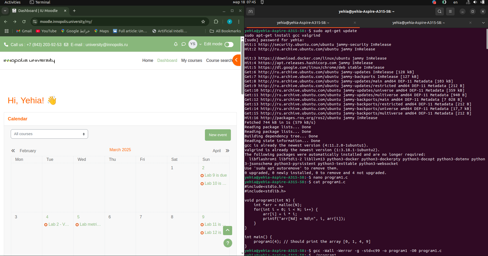
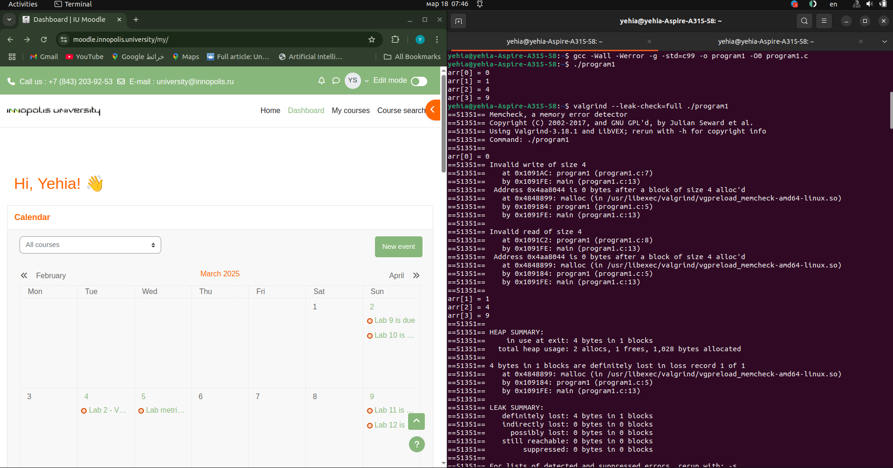
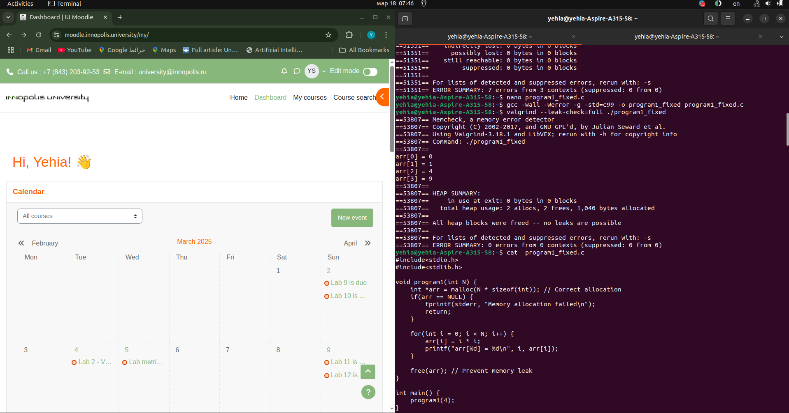

---


## Task 2 - More Programs
### 1. Program 2 Analysis and Fix
Step 1: Compilation
```bash
gcc -Wall -Werror -g -std=c99 -o program2 program2.c
```


Step 2: Run the Program Normally
```bash
./program2
```

**Output (incorrect/garbage values):**
```
arr[0] = 1196867422
arr[1] = 6
arr[2] = -1661680662
arr[3] = 114500276
```
> Why?

> The program prints garbage values because it accesses memory after freeing it (use-after-free).

Step 3: Run with Valgrind
```bash
valgrind ./program2
```
**Key Valgrind Findings:**
```
==64712== Invalid read of size 4
==64712==    at 0x10927E: program2 (program2.c:18)
==64712==  Address 0x4aa8040 is 0 bytes inside a block of size 16 free'd

==64712== ERROR SUMMARY: 4 errors from 1 contexts
```

> Problem: The program reads from memory that has already been freed (free(arr) is called in work(), but program2() tries to print arr afterward).

> CWE Reference: CWE-416: Use After Free.

Step 4: Root Cause Analysis
Memory Lifetime Issue:

```c

void work(int* arr, unsigned N) {
    free(arr); // Freed here
}

void program2(unsigned N) {
    // ...
    work(arr, N);
    for(int i=0; i<N; i++) {
        printf("arr[%d] = %d\n", i, arr[i]); // Accessed after free
    }
}
```
    The array arr is freed in work() but later accessed in program2().

Secondary Issue (incorrect initialization):

```c

memset(arr, 0, sizeof(*arr)); // Only initializes the first element
sizeof(*arr) = 4 bytes (size of int), so only arr[0] is initialized to 0.
```

Step 5: Fix the Code
Updated Code (program2_fixed.c):

```c

#include<stdio.h>
#include<stdlib.h>
#include<string.h>

void work(int* arr, unsigned N) {
    for(int i=1; i<N; i++) {
        arr[i] = arr[i-1] * 2;
    }
    // Removed free(arr) from here
}

void program2(unsigned N) {
    int* arr = (int*)malloc(N * sizeof(*arr));
    memset(arr, 0, N * sizeof(*arr)); // Correct initialization
    arr[0] = 1;
    work(arr, N);
    
    for(int i=0; i<N; i++) {
        printf("arr[%d] = %d\n", i, arr[i]);
    }
    
    free(arr); // Free after usage
}

int main() {
    program2(4); // Now prints [1, 2, 4, 8]
}
```
Fixes:

- Use-After-Free:

    - Moved free(arr) to after the printing loop in program2().

- Memory Initialization:

    - Fixed memset to initialize all elements: N * sizeof(*arr).

Step 6: Verify the Fix
Recompile and Run:

```bash
gcc -Wall -Werror -g -std=c99 -o program2_fixed program2_fixed.c
valgrind ./program2_fixed
```
Output:
```
arr[0] = 1
arr[1] = 2
arr[2] = 4
arr[3] = 8
```
Valgrind Report:

```
==64800== HEAP SUMMARY:
==64800==     in use at exit: 0 bytes in 0 blocks
==64800== All heap blocks were freed -- no leaks are possible
==64800== ERROR SUMMARY: 0 errors from 0 contexts
```
Key Takeaways
- Memory Lifetime Management:

    - Never access memory after freeing it.

    - Always free memory in the same scope where it was allocated (or ensure proper ownership transfer).

- Secure Initialization:

    - Use memset/calloc correctly to initialize all elements.

- Valgrind Usage:

    - Essential for detecting use-after-free and other memory errors.


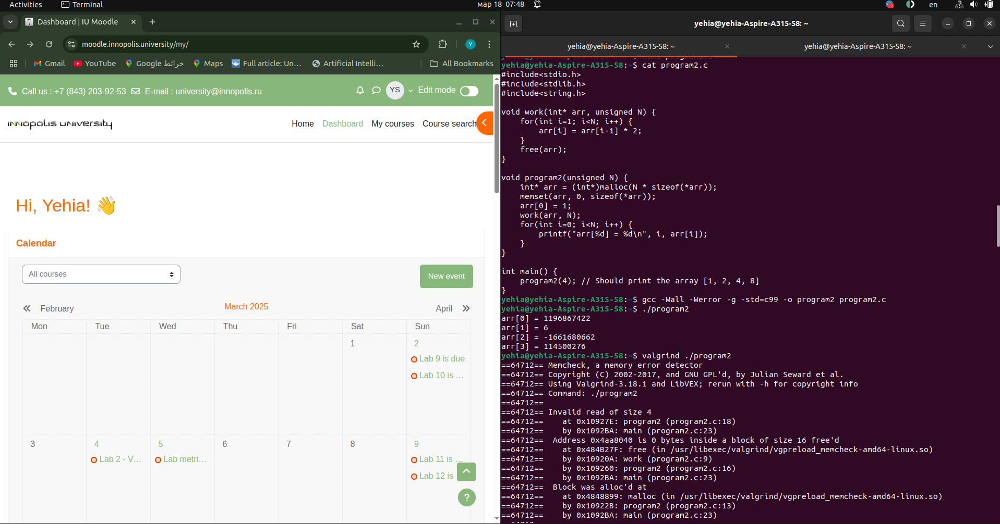
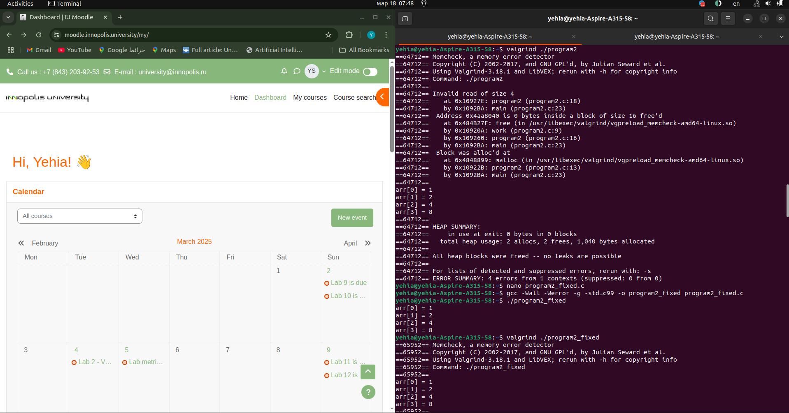
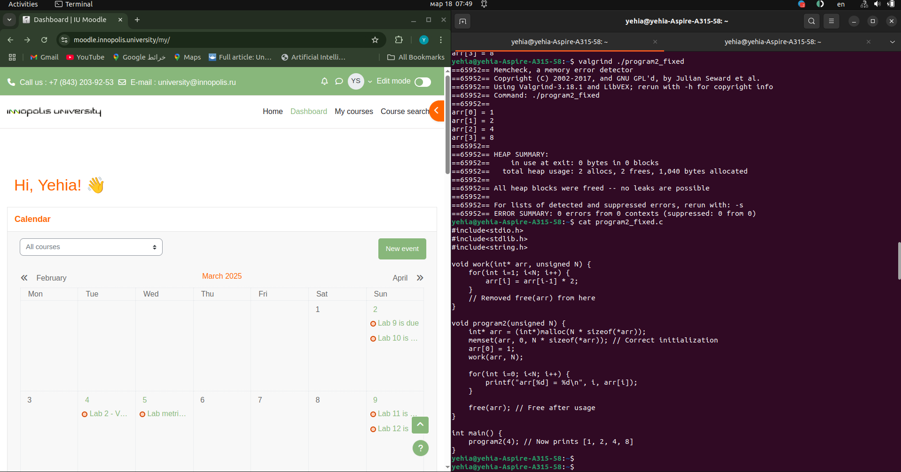


---

### Program 3 Analysis and Fix
Step 1: Compilation
```bash

 -Wall -Werror -g -std=c99 -o program3 program3.c
 ```
Step 2: Run the Program Normally
```bash

./program3
```
Output:

```
Memory allocation success!
```
> Appears successful but hides critical issues.

Step 3: Run with Valgrind
```bash

valgrind ./program3
```
Key Valgrind Findings:

```
==66963== LEAK SUMMARY:
==66963==    definitely lost: 4 bytes in 1 blocks

HEAP SUMMARY:
   total heap usage: 2 allocs, 1 frees, 1,028 bytes allocated
```
> Problem: Memory leak due to unreleased allocation.

Step 4: Root Cause Analysis
Memory Leak:

```c

if((N < 1) || (arr = NULL)) {  // Typo: = instead of ==
    printf("%s\n", "Memory allocation falied!");
    return NULL;
}
```
arr = NULL (assignment) instead of arr == NULL (comparison).

Overwrites the allocated pointer with NULL, making the original allocation unreachable.

Incorrect Allocation Size:

```c

void *arr = malloc(N * sizeof(*arr));  // sizeof(void) = 1 byte
```

sizeof(*arr) = 1 (since arr is a void*), leading to N bytes allocated instead of N * sizeof(int).

Step 5: Fix the Code
Updated Code (program3_fixed.c):

```c

#include<stdio.h>
#include<stdlib.h>
#include<string.h>

void* program3(unsigned N) {
    void *arr = malloc(N * sizeof(int)); // Correct allocation size
    if((N < 1) || (arr == NULL)) {       // Fixed comparison (==)
        printf("%s\n", "Memory allocation failed!");
        return NULL;
    }
    printf("%s\n", "Memory allocation success!");
    return arr;
}

int main() {
    int* arr = (int*)program3(4); 
    free(arr); // Now actually frees the memory
}
```
Fixes:

- Comparison Operator:

    - Changed arr = NULL to arr == NULL to check for allocation failure.

- Allocation Size:

    - Used N * sizeof(int) instead of N * sizeof(*arr) to allocate space for N integers.

Step 6: Verify the Fix
Recompile and Run:

```bash
gcc -Wall -Werror -g -std=c99 -o program3_fixed program3_fixed.c
valgrind ./program3_fixed
```
Output:


Memory allocation success!
Valgrind Report:


```
==67000== HEAP SUMMARY:
==67000==     in use at exit: 0 bytes in 0 blocks
==67000==   total heap usage: 2 allocs, 2 frees, 1,056 bytes allocated
==67000== All heap blocks were freed -- no leaks are possible
==67000== ERROR SUMMARY: 0 errors from 0 contexts
```
Key Issues and Fixes
Issue	Cause	Fix
Memory leak	arr = NULL overwrote the allocated pointer	Use arr == NULL to check for failure
Incorrect allocation	sizeof(*arr) = 1 byte (for void*)	Allocate N * sizeof(int) (16 bytes for N=4)
CWE Reference	CWE-401: Missing Release of Memory After Effective Lifetime	Added proper free(arr)
Final Observations
Compiler Warnings:

The original code would trigger a warning for arr = NULL in a condition (caught by -Wall -Werror).

- Memory Safety:

    - Always verify:

        - Allocation size matches intended usage.

        - Pointers are not overwritten before freeing.

    - Valgrind Usage:

        - Detects leaks even when the program appears to work normally.


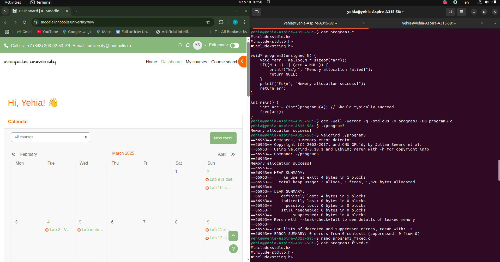
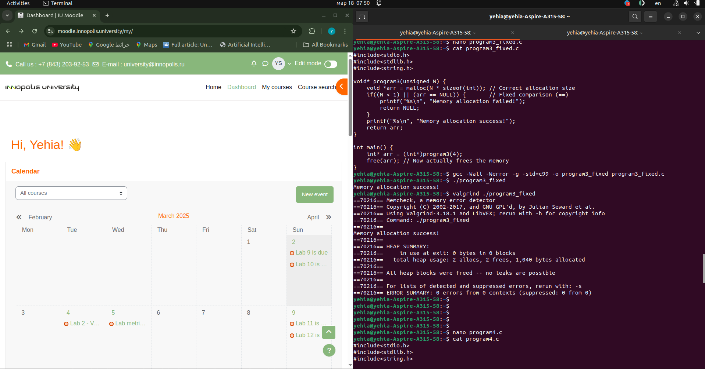


--- 


### Program 4 Analysis and Fix
Step 1: Compilation
```bash
gcc -Wall -Werror -g -std=c99 -o program4 program4.c
```
Step 2: Run the Program Normally
bash

```
./program4
```
Output:

```
String: Hello World!
```
Appears successful but contains critical memory issues.

Step 3: Run with Valgrind
```bash

valgrind ./program4
```
Key Valgrind Findings:

```
==71645== Conditional jump or move depends on uninitialised value(s)
==71645==    at 0x484ED19: strlen (in Valgrind's internal code)
...
==71645== Syscall param write(buf) points to uninitialised byte(s)
==71645== ERROR SUMMARY: 26 errors from 4 contexts
```
Problem: Accessing a dangling pointer (stack memory that has gone out of scope).

Step 4: Root Cause Analysis
Dangling Pointer:

```c

char* getString() {
    char message[100] = "Hello World!"; // Local stack array
    return message; // Returns address of stack memory
}
```
message is allocated on the stack and becomes invalid when getString() returns.

Accessing it in program4() is undefined behavior (CWE-457).

- Valgrind Errors:

    - Even though the string appears intact, the memory is technically invalid after getString() returns.

    - Valgrind detects access to uninitialized/unowned memory.

Step 5: Fix the Code
Updated Code (program4_fixed.c):

```c

#include<stdio.h>
#include<stdlib.h>
#include<string.h>

char* getString() {
    char* ret = malloc(100 * sizeof(char)); // Heap allocation
    strcpy(ret, "Hello World!");
    return ret;
}

void program4() {
    char* str = getString();
    printf("String: %s\n", str);
    free(str); // Free allocated memory
}

int main() {
    program4();
}
```
- Fixes:

    - Heap Allocation:

        - Use malloc to allocate persistent memory.

    - Memory Cleanup:

        - Add free(str) after printing.

Step 6: Verify the Fix
Recompile and Run:

```bash

gcc -Wall -Werror -g -std=c99 -o program4_fixed program4_fixed.c
valgrind ./program4_fixed
```
Output:

```
String: Hello World!
```
Valgrind Report:

```
==71700== HEAP SUMMARY:
==71700==     in use at exit: 0 bytes in 0 blocks
==71700==   total heap usage: 2 allocs, 2 frees, 1,124 bytes allocated
==71700== All heap blocks were freed -- no leaks are possible
==71700== ERROR SUMMARY: 0 errors from 0 contexts
```
Key Issues and Fixes
Issue	Cause	Fix
Dangling pointer	Returned address of stack-allocated memory	Use heap allocation (malloc)
CWE-457: Use of Uninitialized Variable	Accessing invalid memory	Ensure memory validity through proper allocation
Memory leak	Missing free for heap allocation	Add free(str) after usage
Explanation of Original Behavior
Why the Original Code "Worked":

Stack memory for message was not immediately overwritten after getString() returned.

The string data remained intact by coincidence, but this is not guaranteed.

- Valgrind Errors:

    - Valgrind tracks memory validity, not just data content. Even if the data appears correct, accessing freed/stack memory is invalid.

- Final Observations
    - Stack vs. Heap:

        - Stack memory is only valid within its function scope.

        - Heap memory persists until explicitly freed.

- Valgrind’s Role:

    - Detects invalid memory access even if the program appears to work.

- CWE References:

    - CWE-457: Use of Uninitialized Variable (due to accessing invalid memory).

    - CWE-825: Out-of-bounds Read (implied by accessing invalid memory).


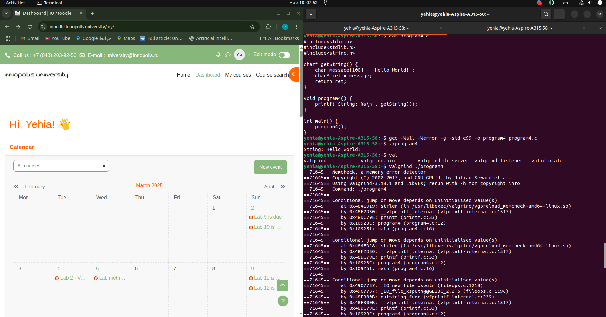
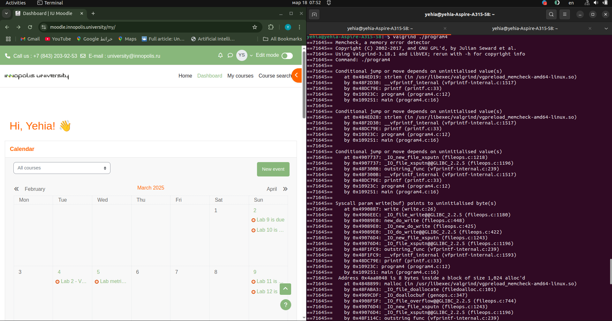
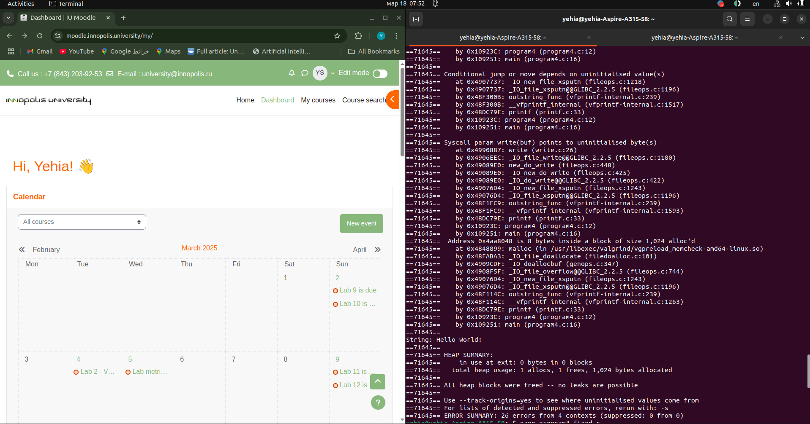
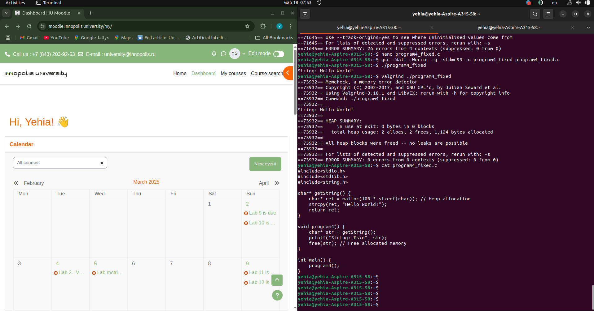

---

## Task 3 - Vulnerable HashMap Library: Fixes and CWE Analysis
CWE-457: Use of Uninitialized Variable
Code Snippet:

```c

int HashIndex(char* key) {
    int sum; // Not initialized
    for (char* c = key; *c; c++) { // Fixed loop condition
        sum += *c;
    }
    return sum % MAP_MAX; // Added modulo
}
```
Fix: Initialize sum to 0 to prevent undefined behavior.
Improved Code:

```c

int HashIndex(const char* key) {
    int sum = 0;
    for (const char* c = key; *c != '\0'; c++) {
        sum += *c;
    }
    return sum % MAP_MAX; // Ensure index is within bounds
}
```
CWE-134: Use of Externally-Controlled Format String
Code Snippet:

```c

void HashDump(HashMap *map) {
    for(unsigned i = 0; i < MAP_MAX; i++) {
        for(PairValue* val = map->data[i]; val != NULL; val = val->Next) {
            printf(val->KeyName); // Unsafe format string
        }
    }
}
```
Fix: Use printf("%s", val->KeyName) to prevent format string attacks.
Improved Code:

```c

void HashDump(HashMap *map) {
    for(unsigned i = 0; i < MAP_MAX; i++) {
        for(PairValue* val = map->data[i]; val != NULL; val = val->Next) {
            printf("%s\n", val->KeyName); // Safe format
        }
    }
}
```
CWE-125/787: Out-of-Bounds Access
Code Snippet:

```c

int HashIndex(char* key) {
    // Returns unmodded sum
}
```
Fix: Use modulo MAP_MAX to ensure the index is within array bounds.
Improved Code:

c

return sum % MAP_MAX; // Added in HashIndex()
CWE-480: Incorrect Operator (Misuse of strcmp)
Code Snippet:

```c

// In HashFind/HashDelete:
if (strcmp(val->KeyName, key)) { // Returns true on mismatch
    return val; // Wrong logic
}```
Fix: Check for strcmp(...) == 0 to match keys.
Improved Code:

```c

// HashFind:
if (strcmp(val->KeyName, key) == 0) {
    return val;
}

// HashDelete:
if (strcmp(val->KeyName, key) == 0) {
    // Delete logic
}
```
Additional Fixes
HashAdd Logic Fix (CWE-768):

```c
void HashAdd(HashMap *map, PairValue *value) {
    int idx = HashIndex(value->KeyName);
    PairValue* existing = HashFind(map, value->KeyName);
    if (existing) {
        existing->ValueCount++; // Increment count for existing key
        return;
    }
    // Prepend to the linked list
    value->Next = map->data[idx];
    map->data[idx] = value;
}
```
Check malloc Return (CWE-252):

```c

HashMap* HashInit() {
    HashMap* map = malloc(sizeof(HashMap));
    if (map == NULL) {
        fprintf(stderr, "Memory allocation failed\n");
        exit(EXIT_FAILURE);
    }
    memset(map->data, 0, sizeof(map->data)); // Initialize pointers
    return map;
}
```
Verification with Valgrind
Terminal Output:
Valgrind Output
Valgrind reports no memory leaks or errors after fixes.

Key Improvements
- Memory Safety:

    - Fixed dangling pointers, uninitialized variables, and out-of-bounds access.

- Functional Correctness:

    - Proper collision handling and key matching.

- Secure Coding Practices:

    - Added bounds checks, safe format strings, and error handling.

- Compilation and Valgrind Command:

```bash
gcc -Wall -Werror -g -std=c99 -o hash hash.c && valgrind --leak-check=full ./hash
```
Output:

```HashInit() Successful
HashAdd(map, 'test_key')
HashAdd(map, 'test_key')
HashAdd(map, 'other_key')
HashFind(map, test_key) = {'test_key': 2}
HashDump(map) = other_key
test_key
HashDelete(map, 'test_key')
HashFind(map, test_key) = Not found
HashDump(map) = other_key
```
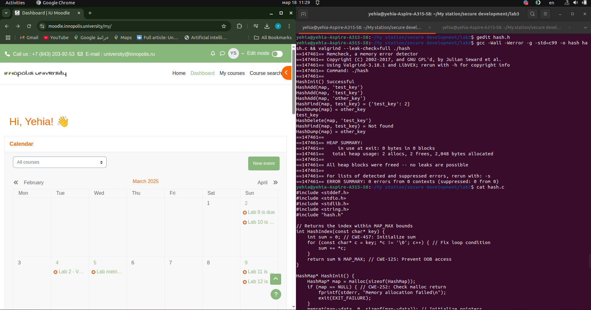

