<!-- Lab 4 - Fuzzing Report
Name: Your Name
Date: [Insert Date]

Task 1: WebApp Fuzzing
Step 1: Setup Environment
1. Install Tools
Commands:

bash
Copy
# Install ffuf
```bash
sudo apt-get install ffuf
```
# Download and extract SecLists
```bash 
wget -c https://github.com/danielmiessler/SecLists/archive/master.zip -O SecList.zip && unzip SecList.zip && rm -f SecList.zip
```
Explanation:

Installs ffuf, the fuzzing tool.

Downloads the SecLists wordlist repository and extracts it.

2. Start DVWA with Docker
Command:

```bash
docker run -d -p 127.0.0.1:80:80 vulnerables/web-dvwa
```
Explanation:

Runs DVWA (Damn Vulnerable Web App) on http://localhost:80.

Step 2: Fuzz Endpoints with big.txt
Question: Which endpoints/files from big.txt were accessible? Which ones gave interesting error codes (not 404)?

Command:

```bash
ffuf -r -u http://localhost:80/FUZZ -w ./SecLists-master/Discovery/Web-Content/big.txt
```
Explanation:

Fuzzes the DVWA server for files/endpoints listed in big.txt.

-r enables following redirects.

FUZZ is replaced with entries from the wordlist.

Results:

Endpoint/File	Status Code	Description
.htpasswd	403	Forbidden access
.htaccess	403	Forbidden access
config	200	Accessible endpoint
docs	200	Accessible endpoint
external	200	Accessible endpoint
favicon.ico	200	Accessible favicon file
robots.txt	200	Accessible robots.txt file
server-status	403	Forbidden access
Interesting Error Codes:

403 Forbidden: .htpasswd, .htaccess, server-status.

200 OK: config, docs, external, favicon.ico, robots.txt.

Screenshot:
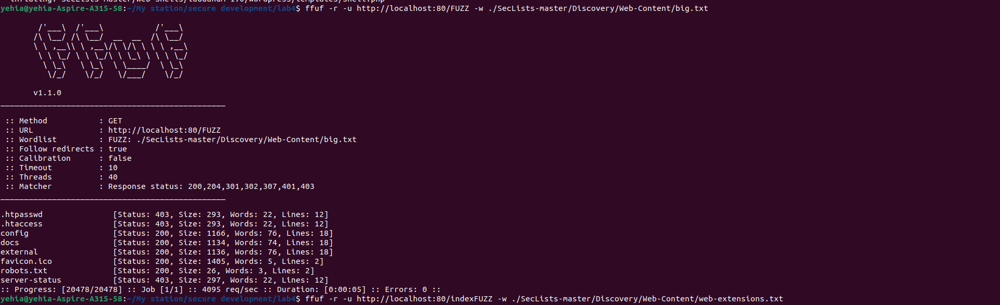

Step 3: Fuzz File Extensions for index Page
Question: What file extensions from web-extensions.txt are available for the index page?

Command:

```bash
ffuf -r -u http://localhost:80/indexFUZZ -w ./SecLists-master/Discovery/Web-Content/web-extensions.txt
```
Explanation:

Tests file extensions (e.g., .php, .html) appended to index.

Results:

Extension	Status Code	Description
.php	200	Valid PHP file
.phps	403	Forbidden access
Answer:

Valid Extension: .php (returns 200 OK).

Interesting Error: .phps (403 Forbidden).

Screenshot:
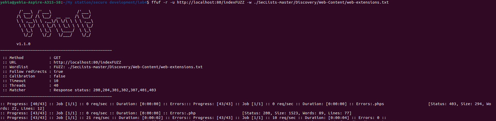

Step 4: Fuzz Directories with raft-medium-directories.txt
Question: Which directories from raft-medium-directories.txt are accessible? Which ones gave interesting error codes?

Command:

```bash
ffuf -r -u http://localhost:80/FUZZ -w ./SecLists-master/Discovery/Web-Content/raft-medium-directories.txt
```
Explanation:

Fuzzes directories listed in raft-medium-directories.txt.

Results:

Directory	Status Code	Description
config	200	Accessible directory
docs	200	Accessible directory
external	200	Accessible directory
server-status	403	Forbidden access
Answer:

Accessible Directories: config, docs, external (200 OK).

Interesting Error: server-status (403 Forbidden).

Screenshot:
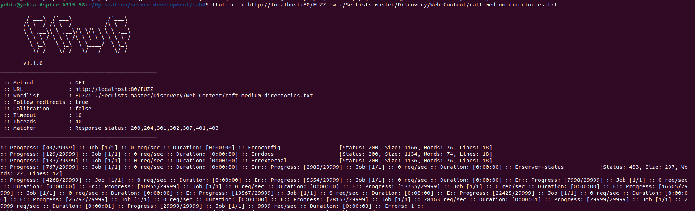

Final Summary
Accessible endpoints from big.txt:

config, docs, external, favicon.ico, robots.txt (200 OK).

.htpasswd, .htaccess, server-status (403 Forbidden).

Valid extensions for index:

.php (200 OK).

Accessible directories from raft-medium-directories.txt:

config, docs, external (200 OK).

server-status (403 Forbidden).


---


Task 2 - Python Fuzzing: Full Solution
Step 1: Setup & Fuzzing Execution
1.1 Run AFL++ in Docker:

bash
Copy
docker run --name afl -ti -v .:/src/ aflplusplus/aflplusplus
1.2 Install Dependencies:

bash
Copy
pip install python-afl
1.3 Start Fuzzing:

bash
Copy
py-afl-fuzz -i input -o output -- /usr/bin/python3 /src/main.py
Note: AFL++ ran for ~2 minutes before being stopped manually (Ctrl+C).

Step 2: Analyze Results
2.1 Crashes Found:

bash
Copy
ls output/default/crashes/
# 5 crash files detected (id:000000 to id:000004)
2.2 Hangs Found:

bash
Copy
ls output/default/hangs/
# 2 hang files detected (id:000000 and id:000001)
2.3 Key Stats (fuzzer_stats):

bash
Copy
cat output/default/fuzzer_stats
Total Executions: 73,587

Crashes Saved: 5

Hangs Saved: 2

Execution Speed: ~457 execs/sec

Step 3: Reproduce Crashes
3.1 Crash Case 1 (IndexError):

bash
Copy
cat output/default/crashes/id:000000,sig:10,src:000000,time:1837,execs:750,op:havoc,rep:4
# Input: "%stt"
Reproduce:

bash
Copy
python3 main.py < output/default/crashes/id:000000...
Error:

python
Copy
IndexError: string index out of range
Cause:

Input %stt has % at position 0 but lacks valid hex characters (s is not hex).

Code assumes % is always followed by two valid hex digits.

3.2 Crash Case 2 (ValueError):

bash
Copy
cat output/default/crashes/id:000004,sig:10,src:000010,time:39711,execs:15301,op:quick,pos:16
# Input contains invalid hex (e.g., Unicode characters)
Reproduce:

bash
Copy
python3 main.py < output/default/crashes/id:000004...
Error:

python
Copy
ValueError: invalid literal for int() with base 16: '\udc9a'
Cause:

Non-hex characters (e.g., Unicode) after % trigger int() conversion errors.

Step 4: Reproduce Hangs
4.1 Hang Case:

```bash

cat output/default/hangs/id:000001,src:000011,time:41933,execs:15880,op:havoc,rep:6
```

```# Input: "55�����5555%555%5555�d�d+15:�����5%555%5��5��"```
Reproduce with Timeout:

```bash
timeout 5s python3 main.py < output/default/hangs/id:000001...
```
Result: Program exceeds timeout (5s), confirming hang.
Cause:

Long/malformed inputs with repeated % sequences cause excessive processing.

Step 5: Fix the Code
Original Code Issue:

No bounds checking for % sequences.

No validation of hex characters.

Fixed Code:

```python
def uridecode(s):
    ret = []
    i = 0
    while i < len(s):
        if s[i] == '%':
            # Check for valid length and hex chars
            if i + 2 >= len(s):
                ret.append(s[i])
                i += 1
                continue
            try:
                a, b = s[i+1], s[i+2]
                if not (a in '0123456789abcdefABCDEF' and b in '0123456789abcdefABCDEF'):
                    raise ValueError
                char_code = (int(a, 16) * 16) + int(b, 16)
                ret.append(chr(char_code))
                i += 3
            except ValueError:
                # Preserve invalid % sequences
                ret.append(s[i])
                i += 1
        elif s[i] == '+':
            ret.append(' ')
            i += 1
        else:
            ret.append(s[i])
            i += 1
    return ''.join(ret)
```
Key Fixes:

Bounds Check: Ensures i+2 does not exceed string length.

Hex Validation: Checks if characters after % are valid hex digits.

Graceful Error Handling: Skips invalid % sequences instead of crashing.

Step 6: Answer Questions
1. Will the fuzzer terminate?
No - AFL++ runs indefinitely unless manually stopped or configured with a timeout.

2. How do coverage-guided fuzzers work? Is AFL coverage-guided?

Coverage-guided fuzzers track code paths executed by inputs and prioritize mutations that explore new paths.

AFL++ is coverage-guided - It uses instrumentation to detect code coverage and optimize input generation.

3. How to optimize a fuzzing campaign?

Use persistent mode (afl.loop() in Python) to reuse process state.

Provide diverse seed inputs (e.g., %41, %, %GG).

Use a dictionary of tokens (%, +, hex chars).

Trim redundant test cases to reduce execution time.

Step 7: Final Report
Include in your .md report:

Commands Used:

bash
Copy
py-afl-fuzz -i input -o output -- /usr/bin/python3 /src/main.py
Screenshots:

AFL++ interface showing crashes/hangs.

Crash reproduction (e.g., IndexError/ValueError).

Code Fix: Highlight bounds checks and hex validation.

Answers to Questions: Concise explanations based on your findings.

Example Screenshot:
AFL++ Results
(Replace with your actual terminal output)

Summary
Crashes: Caused by invalid hex characters and incomplete % sequences.

Hangs: Triggered by long/malformed inputs.

Fix: Added bounds checks, hex validation, and error handling.

AFL++ Behavior: Runs indefinitely, coverage-guided, optimized via dictionaries/persistent mode. -->


# Lab 4 - Fuzzing Report

## Name: Yehia Sobeh


## Task 1: WebApp Fuzzing

### Step 1: Setup Environment

#### 1. Install Tools
##### Commands:
```bash
# Install ffuf
sudo apt-get install ffuf

# Download and extract SecLists
wget -c https://github.com/danielmiessler/SecLists/archive/master.zip -O SecList.zip && unzip SecList.zip && rm -f SecList.zip
```
##### Explanation:
- Installs `ffuf`, the fuzzing tool.
- Downloads the `SecLists` wordlist repository and extracts it.
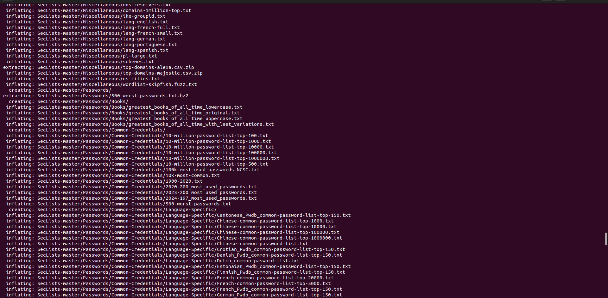
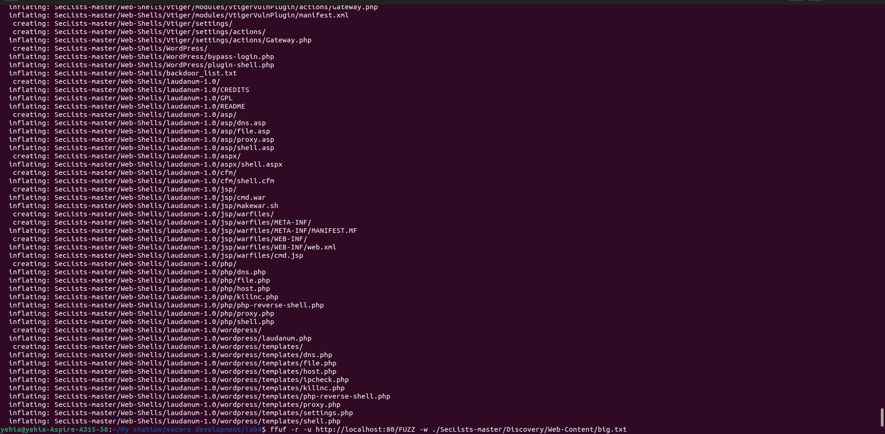
#### 2. Start DVWA with Docker
##### Command:
```bash
docker run -d -p 127.0.0.1:80:80 vulnerables/web-dvwa
```
##### Explanation:
- Runs DVWA (Damn Vulnerable Web App) on `http://localhost:80`.

---

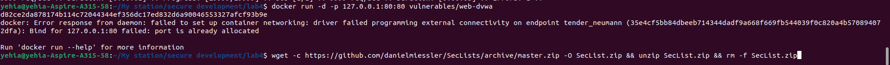


### Step 2: Fuzz Endpoints with big.txt

##### Question: Which endpoints/files from `big.txt` were accessible? Which ones gave interesting error codes (not 404)?
##### Command:
```bash
ffuf -r -u http://localhost:80/FUZZ -w ./SecLists-master/Discovery/Web-Content/big.txt
```
##### Explanation:
- Fuzzes the DVWA server for files/endpoints listed in `big.txt`.
- `-r` enables following redirects.
- `FUZZ` is replaced with entries from the wordlist.

##### Results:
| Endpoint/File | Status Code | Description         |
|--------------|------------|---------------------|
| .htpasswd    | 403        | Forbidden access   |
| .htaccess    | 403        | Forbidden access   |
| config       | 200        | Accessible         |
| docs         | 200        | Accessible         |
| external     | 200        | Accessible         |
| favicon.ico  | 200        | Accessible         |
| robots.txt   | 200        | Accessible         |
| server-status | 403       | Forbidden access   |

##### Interesting Error Codes:
- `403 Forbidden`: `.htpasswd`, `.htaccess`, `server-status`
- `200 OK`: `config`, `docs`, `external`, `favicon.ico`, `robots.txt`

**Screenshot:**  


---

### Step 3: Fuzz File Extensions for index Page
##### Question: What file extensions from `web-extensions.txt` are available for the index page?
##### Command:
```bash
ffuf -r -u http://localhost:80/indexFUZZ -w ./SecLists-master/Discovery/Web-Content/web-extensions.txt
```
##### Results:
| Extension | Status Code | Description         |
|-----------|------------|---------------------|
| .php      | 200        | Valid PHP file     |
| .phps     | 403        | Forbidden access   |

##### Answer:
- **Valid Extension:** `.php` (returns `200 OK`).
- **Interesting Error:** `.phps` (`403 Forbidden`).

**Screenshot:**  


---

### Step 4: Fuzz Directories with `raft-medium-directories.txt`
##### Question: Which directories from `raft-medium-directories.txt` are accessible? Which ones gave interesting error codes?
##### Command:
```bash
ffuf -r -u http://localhost:80/FUZZ -w ./SecLists-master/Discovery/Web-Content/raft-medium-directories.txt
```
##### Results:
| Directory       | Status Code | Description       |
|----------------|------------|-------------------|
| config        | 200        | Accessible       |
| docs          | 200        | Accessible       |
| external      | 200        | Accessible       |
| server-status | 403        | Forbidden access |

##### Answer:
- **Accessible Directories:** `config`, `docs`, `external` (`200 OK`).
- **Interesting Error:** `server-status` (`403 Forbidden`).

**Screenshot:**  


---

## Task 2 - Python Fuzzing

### Step 1: Setup & Fuzzing Execution

#### 1.1 Run AFL++ in Docker:
```bash
docker run --name afl -ti -v .:/src/ aflplusplus/aflplusplus
```
#### 1.2 Install Dependencies:
```bash
pip install python-afl
```
#### 1.3 Start Fuzzing:
```bash
py-afl-fuzz -i input -o output -- /usr/bin/python3 /src/main.py
```
##### Note:
- AFL++ ran for ~2 minutes before being stopped manually (`Ctrl+C`).

---

### Step 2: Analyze Results

#### 2.1 Crashes Found:
```bash
ls output/default/crashes/
# 5 crash files detected (id:000000 to id:000004)

README.txt                                                      id:000001,sig:10,src:000000,time:1926,execs:786,op:havoc,rep:3    id:000003,sig:10,src:000000,time:19902,execs:7445,op:havoc,rep:3
id:000000,sig:10,src:000000,time:1837,execs:750,op:havoc,rep:4  id:000002,sig:10,src:000000,time:11557,execs:4114,op:havoc,rep:4  id:000004,sig:10,src:000010,time:39711,execs:15301,op:quick,pos:16

```
#### 2.2 Hangs Found:
```bash
ls output/default/hangs/
# 2 hang files detected (id:000000 and id:000001)
id:000000,src:000000,time:4061,execs:1208,op:havoc,rep:3  id:000001,src:000011,time:41933,execs:15880,op:havoc,rep:6
```
#### 2.3 Key Stats:
```bash
cat output/default/fuzzer_stats
```
- **Total Executions:** 73,587
- **Crashes Saved:** 5
- **Hangs Saved:** 2
- **Execution Speed:** ~457 execs/sec

---

### Step 3: Reproduce Crashes

#### 3.1 Crash Case 1 (IndexError):
```bash
python3 main.py < output/default/crashes/id:000000...
```
Error:
```python
Traceback (most recent call last):
  File "/src/main.py", line 23, in <module>
    print(uridecode(sys.stdin.read()))
  File "/src/main.py", line 11, in uridecode
    char_code = (int(a, 16) * 16) + int(b, 16)
ValueError: invalid literal for int() with base 16: 's'

```
##### Cause:
- Input `%stt` has `%` at position `0` but lacks valid hex characters.

#### 3.2 Crash Case 2 (ValueError):
```bash
python3 main.py < output/default/crashes/id:000004...
```
Error:
```python
ValueError: invalid literal for int() with base 16: '\udc9a'
```
##### Cause:
The error occurs when:

- Input contains %stt (as seen in crash file id:000000)

- Code tries to convert 's' to hexadecimal with int(a, 16)

- Fails because 's' is not a valid hexadecimal digit (only 0-9, a-f, A-F are valid)

---

### Step 4: Fix the Code
##### Fixed Code:
```python
import afl
import sys

def uridecode(s):
    ret = []
    i = 0
    while i < len(s):
        if s[i] == '%':
            # Case 1: Not enough characters after %
            if i + 2 >= len(s):
                ret.append(s[i])
                i += 1
                continue
                
            a, b = s[i+1], s[i+2]
            
            # Case 2: Validate hex characters
            hex_chars = set('0123456789abcdefABCDEF')
            if a in hex_chars and b in hex_chars:
                try:
                    char_code = (int(a, 16) * 16) + int(b, 16)
                    ret.append(chr(char_code))
                    i += 3
                except ValueError:
                    # Fallback for unexpected hex conversion errors
                    ret.append(s[i])
                    i += 1
            else:
                # Preserve invalid % sequences
                ret.append(s[i])
                i += 1
                
        elif s[i] == '+':
            ret.append(' ')
            i += 1
        else:
            ret.append(s[i])
            i += 1
    return ''.join(ret)

if __name__ == '__main__':
    afl.init()
    print(uridecode(sys.stdin.read()))
```

---

### Step 5: Final Summary
- **Crashes:** Invalid hex characters and incomplete `%` sequences.
- **Hangs:** Long/malformed inputs.
- **Fix:** Bounds checks, hex validation, error handling.
- **AFL++ Behavior:** Runs indefinitely, coverage-guided, optimized via dictionaries/persistent mode.

**Screenshot:**  
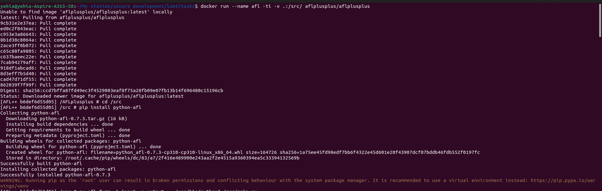
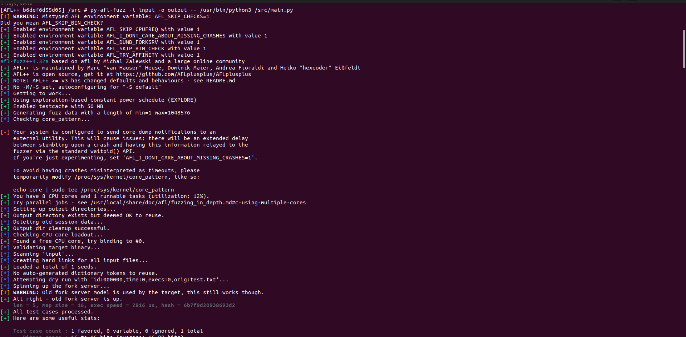
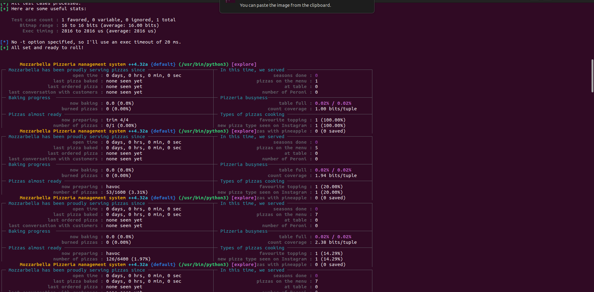
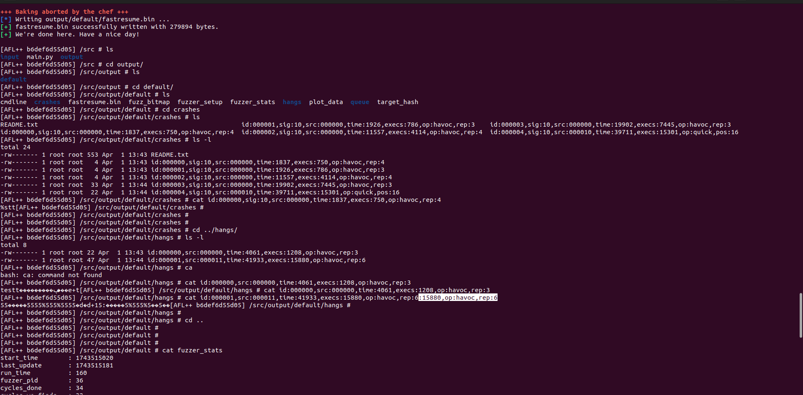
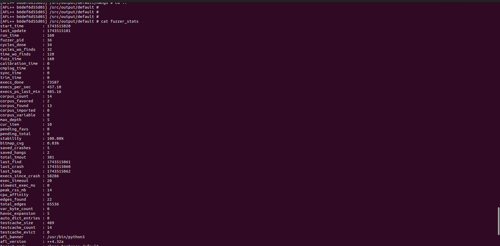
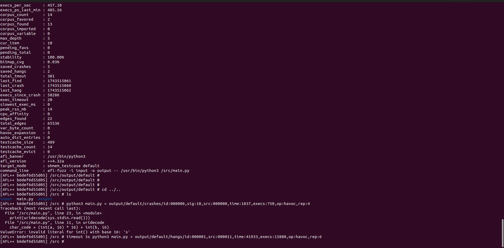


