# Secure System Development - Lab 1

## Task 1 - GitLab Server
1.  Provisioning Infrastructure<br>
• VMs/Containers:
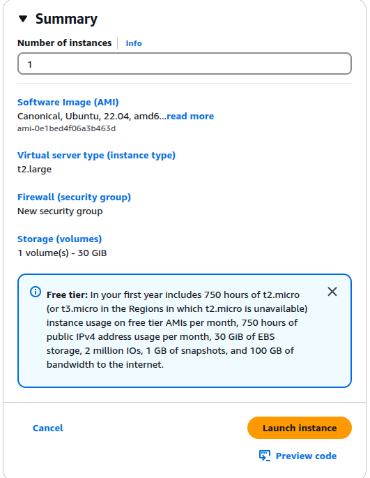
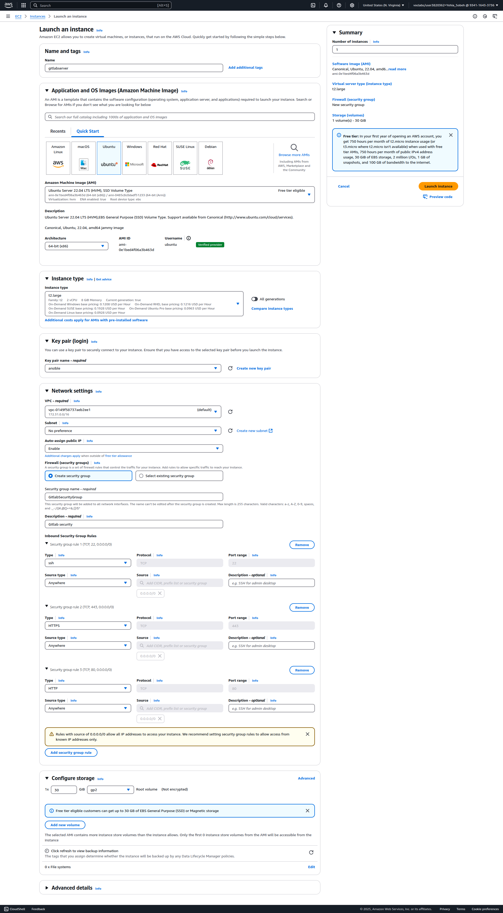
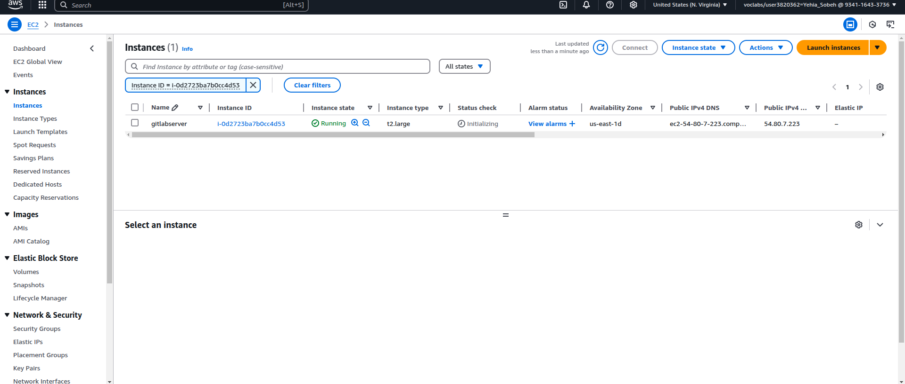

Step 2: Configuring Security Groups
Updated security groups to allow inbound traffic:
GitLab Server:
SSH on port 2222
HTTP on port 80
HTTPS on port 443
GitLab Runner:
SSH on port 22
HTTP on port 80
HTTPS on port 443
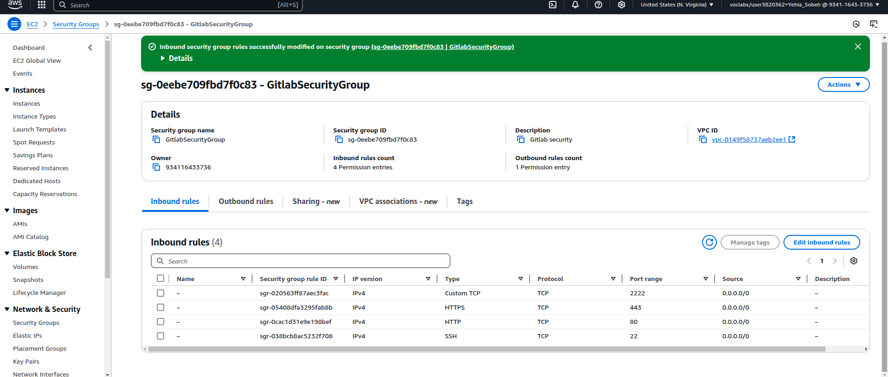

Step 3: Installing Docker on GitLab Server
Connected to the GitLab Server instance via SSH and installed Docker.
```
ssh -i "gitlab1.pem" ubuntu@ec2-54-157-39-84.compute-1.amazonaws.com

# Add Docker's official GPG key:
sudo apt-get update
sudo apt-get install ca-certificates curl
sudo install -m 0755 -d /etc/apt/keyrings
sudo curl -fsSL https://download.docker.com/linux/ubuntu/gpg -o /etc/apt/keyrings/docker.asc
sudo chmod a+r /etc/apt/keyrings/docker.asc

# Add the repository to Apt sources:
echo \
  "deb [arch=$(dpkg --print-architecture) signed-by=/etc/apt/keyrings/docker.asc] https://download.docker.com/linux/ubuntu \
  $(. /etc/os-release && echo "${UBUNTU_CODENAME:-$VERSION_CODENAME}") stable" | \
  sudo tee /etc/apt/sources.list.d/docker.list > /dev/null
sudo apt-get update

sudo apt-get install docker-ce docker-ce-cli containerd.io docker-buildx-plugin docker-compose-plugin

sudo usermod -aG docker $USER
newgrp docker
docker -v
docker compose version

```
Step 4: Creating docker-compose.yml for GitLab Server
Created a docker-compose.yml file to configure and run the GitLab container.
```
version: '3.8'
services:
  gitlab:
    image: gitlab/gitlab-ce:latest
    container_name: 22BS283-gitlab
    restart: always
    hostname: 'gitlab.test.local'
    environment:
      GITLAB_OMNIBUS_CONFIG: |
        external_url 'https://gitlab.test.local'
        gitlab_rails['gitlab_shell_ssh_port'] = 2222
        nginx['http2_enabled'] = true
        nginx['redirect_http_to_https'] = true
        nginx['ssl_certificate'] = "/etc/gitlab/ssl/gitlab.test.local.crt"
        nginx['ssl_certificate_key'] = "/etc/gitlab/ssl/gitlab.test.local.key"
        gitlab_rails['registry_enabled'] = false
        mattermost['enable'] = false
        gitlab_pages['enable'] = false
        gitlab_kas['enable'] = false
        letsencrypt['enable'] = false
    ports:
      - '80:80'
      - '443:443'
      - '2222:22'
    volumes:
      - '/srv/gitlab/config:/etc/gitlab'
      - '/srv/gitlab/logs:/var/log/gitlab'
      - '/srv/gitlab/data:/var/opt/gitlab'
      - '/etc/gitlab/ssl:/etc/gitlab/ssl'
    shm_size: '256m'
```
Step 5: Generating Self-Signed Certificates with mkcert
Installed mkcert and generated self-signed certificates for HTTPS.
- Install the Local CA:
Run mkcert to install a local certificate authority (CA). This step sets up mkcert’s CA and adds it to your system’s trusted certificates:
```
mkcert -install
```
- Generate the Certificates:
Generate a certificate for your GitLab server domain (e.g., gitlab.test.local):
```
mkcert gitlab.test.local
```
This command creates two files in your current directory:

gitlab.test.local.pem (the certificate)
gitlab.test.local-key.pem (the private key)

- Rename the Certificate Files (Optional):
To match the names specified in your docker-compose.yml (if needed), rename the files:
```
mv gitlab.test.local.pem gitlab.test.local.crt
mv gitlab.test.local-key.pem gitlab.test.local.key
```
- Place the Certificates in the Correct Directory:
Move or copy these certificate files to the directory that is mounted into your GitLab container (for example, /etc/gitlab/ssl):
```
sudo mkdir -p /etc/gitlab/ssl
sudo cp gitlab.test.local.crt gitlab.test.local.key /etc/gitlab/ssl/
```
- Verify the Setup:
Confirm that the certificate files exist in /etc/gitlab/ssl and that your Docker Compose configuration points to these files. Your docker-compose.yml should reference them like this:
``` 
environment:
  GITLAB_OMNIBUS_CONFIG: |
    external_url 'https://gitlab.test.local'
    nginx['ssl_certificate'] = "/etc/gitlab/ssl/gitlab.test.local.crt"
    nginx['ssl_certificate_key'] = "/etc/gitlab/ssl/gitlab.test.local.key"

```
Step 6: Updating /etc/hosts
Updated the /etc/hosts file to resolve gitlab.test.local to the server's public IP on my local host and on the vm .
```sudo nano /etc/hosts```
on my localhost and VM
```
127.0.0.1	localhost
127.0.1.1	yehia-Aspire-A315-58
3.90.40.223 gitlab.test.local
# The following lines are desirable for IPv6 capable hosts
::1     ip6-localhost ip6-loopback
fe00::0 ip6-localnet
ff00::0 ip6-mcastprefix
ff02::1 ip6-allnodes
ff02::2 ip6-allrouters
```
Step 7: Running GitLab Server
Started the GitLab container using docker-compose.
```
docker compose up -d
```
Reading the Password File Inside the Container:
```
sudo docker exec -it <container_name> cat /etc/gitlab/initial_root_password
```
```
docker exec -it yehia-gitlab cat /etc/gitlab/initial_root_password
```
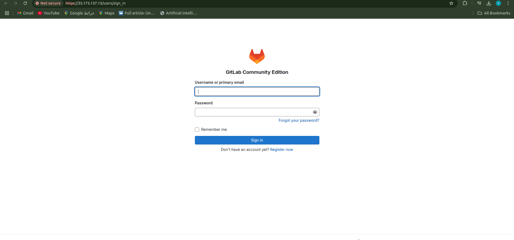

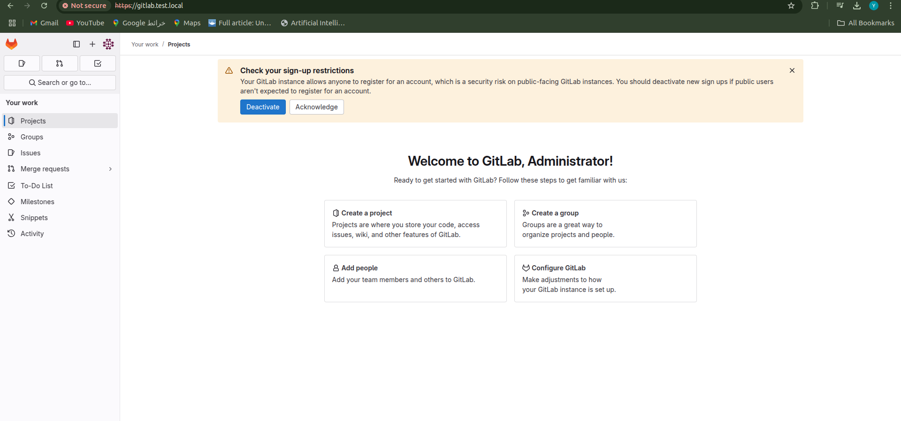
4. creating repo
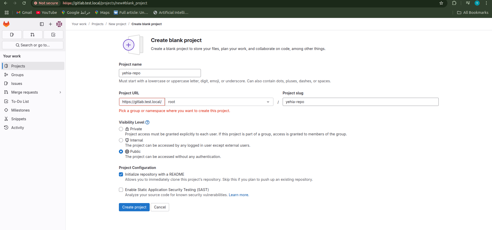
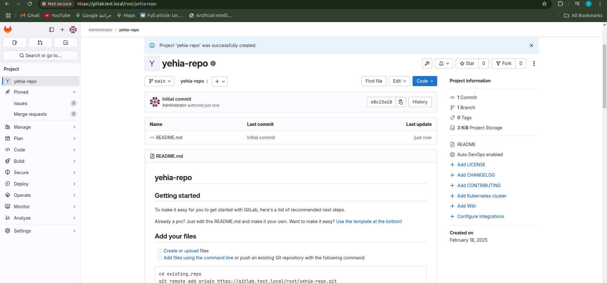
## Task 2 - GitLab Runner
-  Step 4:Creating and Registering Runner
Created a GitLab Runner with the tag yehia-runner and registered it with the GitLab server.

- - Add the GitLab Runner Repository:
GitLab provides an installation script that sets up the repository on your system. Run the following command:
``` curl -L https://packages.gitlab.com/install/repositories/runner/gitlab-runner/script.deb.sh | sudo bash
```
This script automatically adds the GitLab Runner repository and installs any prerequisites.


- - Install GitLab Runner:
With the repository added, install GitLab Runner using apt:

```
sudo apt-get install gitlab-runner
```
Verify the Installation:
```
gitlab-runner --version
```
- - verify gitLab runner as a service
```
sudo systemctl status gitlab-runner
```
Step 4: Creating and Registering GitLab Runner
```
gitlab-runner register  --url https://gitlab.test.local  --token glrt-t3_4vJ_REAs8j2TH3vGnX3f
Runtime platform                                    arch=amd64 os=linux pid=11592 revision=690ce25c version=17.8.3
```
Runner executor(since we are running jobs directly on this EC2 instance):
```
shell
```
to start it
```
 gitlab-runner run
 ```
Start and Enable GitLab Runner(optional )

```
sudo systemctl start gitlab-runner
```
Enable the runner to start on system boot:

```
sudo systemctl enable gitlab-runner
```
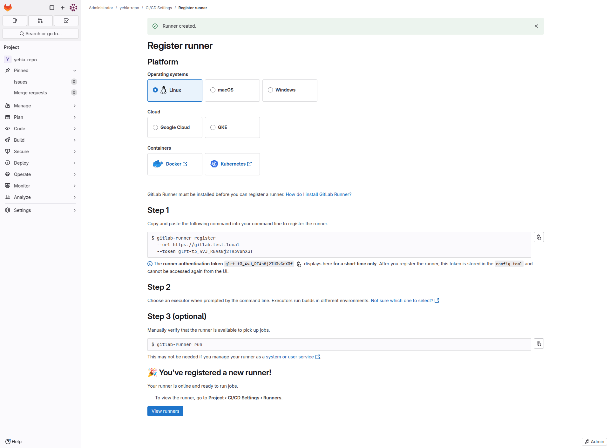
- Step 5: Validating Runner Connection
Verified that the Runner is connected to the GitLab server.


## Task 3: Integrating SAST with GitLab CI
Step 1: Cloning a Vulnerable Application
Cloned the Damn Vulnerable Java Application (DVJA) and removed its .git directory.
first open a new ssh session in new terinal then:
```
git clone https://github.com/appsecco/DVJA.git
```
 Step 1: Remove the .git Directory
```
cd DVJA
rm -rf .git
ls -la
```
Step 2: Initialize a New Git Repository
```
git init
git add .
git commit -m "Initial commit of DVJA to GitLab"

```
 Step 3: Add Your GitLab Repository as Remote
 ```
 git remote add origin https://gitlab.test.local/root/yehia-repo.git
 ```
 ```
 git branch -M main
```
```
git pull --rebase origin main

```
```
git add *
```
```
git rebase --continue

```

```
git push -u origin main
```

Step 2: Creating .gitlab-ci.yml for Semgrep SAST Scanning
-  ChangeInside  repository directory

```
cd ~/DVJA 

```

``` 
nano .gitlab-ci.yml
```
```
stages:
  - test

semgrep-sast:
  stage: test
  script:
    - semgrep --config=auto --json > semgrep-report.json
  artifacts:
    paths:
      - semgrep-report.json
  rules:
    - if: $CI_COMMIT_REF_NAME == "main"
```
then
```
git add .gitlab-ci.yml
git commit -m "Added GitLab CI pipeline for Semgrep SAST"
git push origin main
```
after i pushed there was an error semgrep not found in the runner so
```
sudo apt install semgrep
```
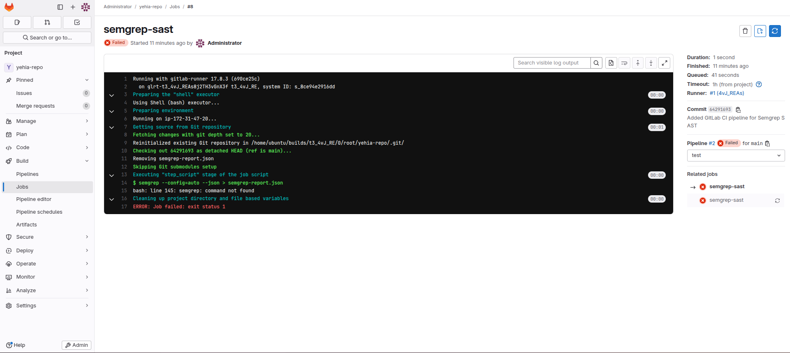
after that i launched the ci again 
```
echo "Updated pipeline" >> README.md
git add README.md
git commit -m "Triggering CI/CD pipeline"
git push origin main
```
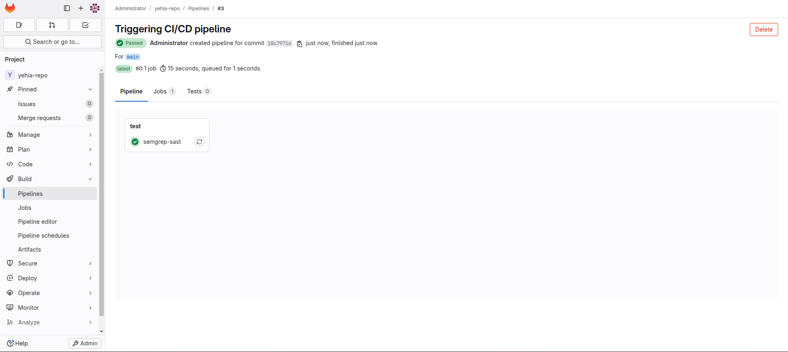
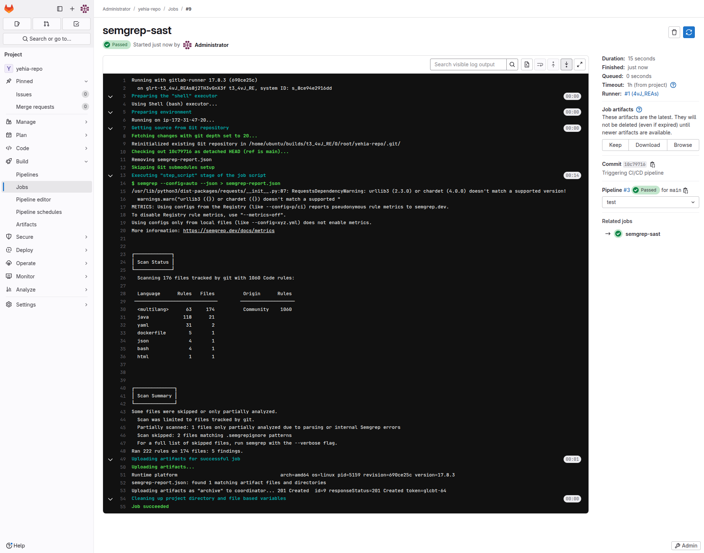
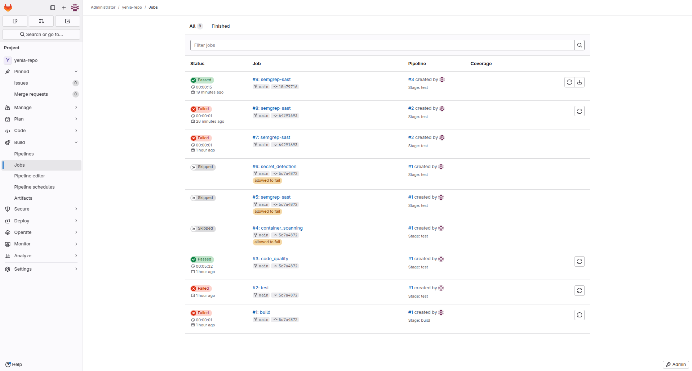

Step 4: Analyzing the SAST Report
after installing the artifact semgrep-report.json and and reformatted to be readable the result it was the following 

| Vulnerability Description                                                                                     | File                                          | Line  | Severity | Solution                                                                                                                                                                                                                     | References                                                                                                                                                                                                 |
|---------------------------------------------------------------------------------------------------------------|-----------------------------------------------|-------|----------|-----------------------------------------------------------------------------------------------------------------------------------------------------------------------------------------------------------------------------|-------------------------------------------------------------------------------------------------------------------------------------------------------------------------------------------------------------|
| **Missing non-root user in Dockerfile** - Running as root poses security risks.                               | `Dockerfile`                                  | 17    | ERROR    | **Add a non-root user and switch to it:**<br>```dockerfile<br>RUN adduser --disabled-password --gecos "" appuser<br>USER appuser<br>CMD ["sh", "-c", "/app/scripts/start.sh"]```                                              | [OWASP A04: Insecure Design](https://owasp.org/Top10/A04_2021-Insecure_Design)                                                                                                                             |
| **Privilege escalation risk in Docker Compose (MySQL)** - Allows privilege escalation via `setuid/setgid`.    | `docker-compose.yml`                          | 3     | WARNING  | **Add `no-new-privileges: true`:**<br>```yaml<br>services:<br>  mysql:<br>    security_opt:<br>      - no-new-privileges:true```                                                                                             | [Docker Security Cheat Sheet](https://cheatsheetseries.owasp.org/cheatsheets/Docker_Security_Cheat_Sheet.html#rule-4-add-no-new-privileges-flag)                                                           |
| **Writable root filesystem in Docker Compose (MySQL)** - Risk of file tampering.                              | `docker-compose.yml`                          | 3     | WARNING  | **Set filesystem to read-only:**<br>```yaml<br>services:<br>  mysql:<br>    read_only: true```                                                                                                                               | [Docker Read-Only Filesystems](https://cheatsheetseries.owasp.org/cheatsheets/Docker_Security_Cheat_Sheet.html#rule-8-set-filesystem-and-volumes-to-read-only)                                             |
| **SQL Injection in Java (ProductService.java)** - Formatted SQL string exposes injection risks.               | `src/main/java/com/appsecco/dvja/services/ProductService.java` | 48    | ERROR    | **Use `PreparedStatement`:**<br>```java<br>String query = "SELECT * FROM products WHERE id = ?";<br>PreparedStatement stmt = connection.prepareStatement(query);<br>stmt.setString(1, userInput);<br>ResultSet rs = stmt.executeQuery();``` | [OWASP SQL Injection Prevention](https://cheatsheetseries.owasp.org/cheatsheets/SQL_Injection_Prevention_Cheat_Sheet.html)                                                                                 |
| **SQL Injection in Java (UserService.java)** - Formatted SQL string exposes injection risks.                  | `src/main/java/com/appsecco/dvja/services/UserService.java`    | 75    | ERROR    | **Use `PreparedStatement`:**<br>```java<br>String query = "SELECT * FROM users WHERE id = ?";<br>PreparedStatement stmt = connection.prepareStatement(query);<br>stmt.setString(1, userInput);<br>ResultSet rs = stmt.executeQuery();```   | [Java PreparedStatements](https://docs.oracle.com/javase/tutorial/jdbc/basics/prepared.html)                                                                                                               |
| **Semgrep Report Syntax Error** - Invalid syntax in report generation.                                        | `semgrep-report.json`                         | 1     | WARN     | Regenerate the report or update Semgrep.                                                                                                                                                                                    | [Semgrep Documentation](https://semgrep.dev/docs/)                                                                                                                                                         |
